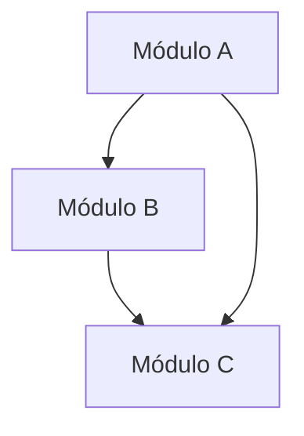
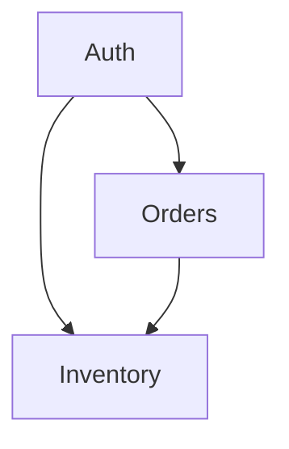

# Formato AGENTS.md — SIXTEMA-SDD

## Plantilla Base

```markdown
# AGENTS.md — Mapa de Enrutado para Agentes de IA

> Generado por SIXTEMA-SDD Pipeline
> Versión: 1.0.0
> Fecha: YYYY-MM-DD

## Estructura del Proyecto

```
/
├── AGENTS.md                           ← Estás aquí
├── documentacion/
│   ├── especificaciones_estructurales/
│   │   ├── [modulo]-estructural.md
│   │   └── ...
│   └── especificaciones_funcionales/
│       ├── [modulo]-funcional.md
│       └── ...
```

## Módulos del Sistema

### [Nombre del Módulo 1]

**Propósito:** [Descripción en una línea]

**Especificaciones:**
- Estructural: `documentacion/especificaciones_estructurales/[modulo]-estructural.md`
- Funcional: `documentacion/especificaciones_funcionales/[modulo]-funcional.md`

**Contratos que NO DEBES romper:**
- [Endpoint/servicio 1]
- [Interface 2]

**Dependencias:**
- [Módulo X] → [Qué proporciona]

---

### [Nombre del Módulo 2]

[Repetir estructura]

---

## Guía de Navegación por Funcionalidad

### Si necesitas implementar: [Funcionalidad X]

1. **Lee primero:**
   - `documentacion/especificaciones_funcionales/[modulo]-funcional.md` → Sección [X]
   - `documentacion/especificaciones_estructurales/[modulo]-estructural.md` → Sección [Y]

2. **Contratos a respetar:**
   - [Contrato 1]: [Descripción breve]
   - [Contrato 2]: [Descripción breve]

3. **Invariantes del dominio:**
   - [Invariante 1]
   - [Invariante 2]

4. **NO rompas:**
   - [Interfaz/contrato que debe mantenerse estable]

---

### Si necesitas implementar: [Funcionalidad Y]

[Repetir estructura]

---

## Dependencias entre Módulos



**Orden de lectura recomendado:**
1. [Módulo base/sin dependencias]
2. [Módulo que depende del anterior]
3. [Módulo que depende de ambos]

---

## Contratos Críticos

Los siguientes contratos son compartidos entre múltiples módulos. Cualquier cambio DEBE considerar el impacto en todos los consumidores:

| Contrato | Módulo Propietario | Consumidores | Notas |
|----------|-------------------|--------------|-------|
| [API/Interfaz 1] | [Módulo] | [Módulo A, Módulo B] | [Restricciones] |
| [API/Interfaz 2] | [Módulo] | [Módulo C] | [Restricciones] |

---

## Glosario Rápido

| Término | Definición Rápida | Spec Completa |
|---------|-------------------|---------------|
| [Término 1] | [1 línea] | [Módulo]-funcional.md → Glosario |
| [Término 2] | [1 línea] | [Módulo]-funcional.md → Glosario |

---

## Notas para Agentes de IA

- **Scope:** Cada módulo es independiente. No asumas estado compartido a menos que la spec lo declare explícitamente.
- **Versionado:** Las specs usan SemVer. Si modificas un contrato, actualiza la versión.
- **Validación:** Antes de implementar, verifica que tu código cumpla con los invariantes declarados.
- **Preguntas:** Si algo no está claro, consulta la spec funcional del módulo antes de asumir.
```

---

## Ejemplo: Proyecto con 3 Módulos

```markdown
# AGENTS.md — Mapa de Enrutado para Agentes de IA

> Generado por SIXTEMA-SDD Pipeline
> Versión: 1.0.0
> Fecha: 2026-06-12

## Estructura del Proyecto

```
/
├── AGENTS.md                           ← Estás aquí
├── documentacion/
│   ├── especificaciones_estructurales/
│   │   ├── auth-estructural.md
│   │   ├── orders-estructural.md
│   │   └── inventory-estructural.md
│   └── especificaciones_funcionales/
│       ├── auth-funcional.md
│       ├── orders-funcional.md
│       └── inventory-funcional.md
```

## Módulos del Sistema

### Auth (Autenticación)

**Propósito:** Gestiona autenticación y autorización de usuarios

**Especificaciones:**
- Estructural: `documentacion/especificaciones_estructurales/auth-estructural.md`
- Funcional: `documentacion/especificaciones_funcionales/auth-funcional.md`

**Contratos que NO DEBES romper:**
- POST /api/v1/auth/login → Token JWT
- POST /api/v1/auth/refresh → Nuevo token
- middleware authenticate() → User context

**Dependencias:**
- Base de datos → Almacena usuarios y tokens
- Redis → Cache de tokens revocados

---

### Orders (Pedidos)

**Propósito:** Gestiona el ciclo de vida de pedidos

**Especificaciones:**
- Estructural: `documentacion/especificaciones_estructurales/orders-estructural.md`
- Funcional: `documentacion/especificaciones_funcionales/orders-funcional.md`

**Contratos que NO DEBES romper:**
- POST /api/v1/orders → Crear pedido
- GET /api/v1/orders/:id → Obtener pedido
- PUT /api/v1/orders/:id/cancel → Cancelar pedido

**Dependencias:**
- Auth → Verifica usuario autenticado
- Inventory → Reserva stock

---

### Inventory (Inventario)

**Propósito:** Gestiona stock y disponibilidad de productos

**Especificaciones:**
- Estructural: `documentacion/especificaciones_estructurales/inventory-estructural.md`
- Funcional: `documentacion/especificaciones_funcionales/inventory-funcional.md`

**Contratos que NO DEBES romper:**
- GET /api/v1/inventory/:sku → Stock disponible
- PUT /api/v1/inventory/:sku/reserve → Reservar stock
- PUT /api/v1/inventory/:sku/release → Liberar stock

**Dependencias:**
- Base de datos → Almacena stock

---

## Guía de Navegación por Funcionalidad

### Si necesitas implementar: Creación de Pedido

1. **Lee primero:**
   - `documentacion/especificaciones_funcionales/orders-funcional.md` → Caso de Uso CU-001
   - `documentacion/especificaciones_estructurales/orders-estructural.md` → Contratos de API

2. **Contratos a respetar:**
   - POST /api/v1/orders → Debe retornar 201 con body { id, status, total }
   - POST /api/v1/inventory/:sku/reserve → Debe verificar stock antes de reservar

3. **Invariantes del dominio:**
   - INV-001: Un pedido NUNCA puede tener stock negativo
   - INV-002: Un pedido ENVIADO NO puede cancelarse

4. **NO rompas:**
   - El contrato de Auth middleware (debe pasar user context)

---

### Si necesitas implementar: Cancelación de Pedido

1. **Lee primero:**
   - `documentacion/especificaciones_funcionales/orders-funcional.md` → Regla de Negocio RN-003
   - `documentacion/especificaciones_estructurales/orders-estructural.md` → Endpoint PUT /orders/:id/cancel

2. **Contratos a respetar:**
   - PUT /api/v1/orders/:id/cancel → Solo permitido si status = CREADO o PAGADO
   - PUT /api/v1/inventory/:sku/release → Debe liberar stock reservado

3. **Invariantes del dominio:**
   - INV-003: Al cancelar, el stock DEBE liberarse
   - INV-004: El estado历史 DEBE registrarse

4. **NO rompas:**
   - El contrato de Inventory (release debe ser atómico)

---

## Dependencias entre Módulos



**Orden de lectura recomendado:**
1. Auth (base de autenticación)
2. Inventory (base de datos)
3. Orders (depende de ambos)

---

## Contratos Críticos

Los siguientes contratos son compartidos entre múltiples módulos:

| Contrato | Módulo Propietario | Consumidores | Notas |
|----------|-------------------|--------------|-------|
| middleware authenticate() | Auth | Orders, Inventory | Retorna user context |
| POST /inventory/:sku/reserve | Inventory | Orders | Requiere stock suficiente |
| GET /inventory/:sku | Inventory | Orders, Frontend | Retorna stock disponible |

---

## Glosario Rápido

| Término | Definición Rápida | Spec Completa |
|---------|-------------------|---------------|
| Pedido | Intención de compra con 1+ productos | orders-funcional.md → Glosario |
| SKU | Identificador único de producto | inventory-funcional.md → Glosario |
| Token | Credencial temporal de autenticación | auth-funcional.md → Glosario |
| Reservar | Apartar stock temporalmente | inventory-funcional.md → Glosario |

---

## Notas para Agentes de IA

- **Scope:** Cada módulo es independiente. No asumas estado compartido a menos que la spec lo declare explícitamente.
- **Versionado:** Las specs usan SemVer. Si modificas un contrato, actualiza la versión.
- **Validación:** Antes de implementar, verifica que tu código cumpla con los invariantes declarados.
- **Preguntas:** Si algo no está claro, consulta la spec funcional del módulo antes de asumir.
```

---

## Principios de Enrutado

### 1. Mínimo Contexto Necesario
El agente debe leer SOLO lo que necesita. Si una feature solo toca el módulo Orders, no leas Auth ni Inventory.

### 2. Sin Specs Completas Innecesarias
Si una feature solo necesita 2 secciones de una spec, cita las secciones, no el archivo entero:
```markdown
- `orders-funcional.md` → Caso de Uso CU-001 (NO el archivo completo)
```

### 3. Orden de Lectura Explícito
Cuando hay dependencias entre specs, indica el orden:
```markdown
1. Lee auth-estructural.md primero (define el middleware)
2. Luego orders-funcional.md (usa el middleware)
```

### 4. Aviso de Contratos
Señala explícitamente qué contratos/interfaces no debe romper:
```markdown
**NO rompas:**
- POST /api/v1/auth/login → Debe retornar siempre JWT
- middleware authenticate() → No cambiar firma
```