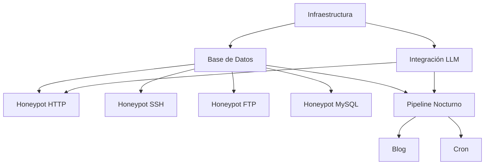

# AGENTS.md — Mapa de Enrutado para Agentes de IA

> Generado por SIXTEMA-SDD Pipeline
> Versión: 1.0.0
> Fecha: 2026-06-12

## Estructura del Proyecto

```
/
├── AGENTS.md                           ← Estás aquí
├── CONTEXT.md                          ← Contexto original del proyecto
├── documentacion/
│   ├── especificaciones_estructurales/
│   │   ├── infraestructura-estructural.md
│   │   ├── base-datos-estructural.md
│   │   ├── honeypot-http-estructural.md
│   │   ├── honeypot-ssh-estructural.md
│   │   ├── honeypot-ftp-estructural.md
│   │   ├── honeypot-mysql-estructural.md
│   │   ├── llm-estructural.md
│   │   ├── pipeline-estructural.md
│   │   ├── blog-estructural.md
│   │   └── cron-estructural.md
│   └── especificaciones_funcionales/
│       ├── infraestructura-funcional.md
│       ├── base-datos-funcional.md
│       ├── honeypot-http-funcional.md
│       ├── honeypot-ssh-funcional.md
│       ├── honeypot-ftp-funcional.md
│       ├── honeypot-mysql-funcional.md
│       ├── llm-funcional.md
│       ├── pipeline-funcional.md
│       ├── cron-funcional.md
│       └── lecciones-aprendidas.md
```

---

## Módulos del Sistema

### Infraestructura

**Propósito:** Define la estructura base del proyecto, dependencias, Docker y configuración de entorno.

**Especificaciones:**
- Estructural: `documentacion/especificaciones_estructurales/infraestructura-estructural.md`
- Funcional: `documentacion/especificaciones_funcionales/infraestructura-funcional.md`

**Contratos que NO DEBES romper:**
- `package.json` — dependencias del proyecto
- `docker-compose.yml` — orquestación de servicios
- `.env` — variables de configuración
- Estructura de carpetas: `src/`, `data/`, `blog/`, `templates/`

**Dependencias:**
- Ninguna (módulo base)

---

### Base de Datos

**Propósito:** Persiste datos de ataques, sesiones e informes en SQLite con WAL mode.

**Especificaciones:**
- Estructural: `documentacion/especificaciones_estructurales/base-datos-estructural.md`
- Funcional: `documentacion/especificaciones_funcionales/base-datos-funcional.md`

**Contratos que NO DEBES romper:**
- Tabla `attacks` — schema (no cambiar columnas sin migración)
- Tabla `sessions` — schema
- Tabla `reports` — schema
- Funciones de `db/queries.js` — interfaz pública

**Dependencias:**
- Infraestructura → config de DB_PATH, DATA_RETENTION_DAYS

---

### Honeypot HTTP

**Propósito:** Simula panel de admin web que captura credenciales, payloads HTTP y genera respuestas realistas con LLM.

**Especificaciones:**
- Estructural: `documentacion/especificaciones_estructurales/honeypot-http-estructural.md`
- Funcional: `documentacion/especificaciones_funcionales/honeypot-http-funcional.md`

**Contratos que NO DEBES romper:**
- `GET /` — login page (HTML)
- `POST /login` — proceso de login (SIEMPRE retorna 200, nunca 401/403)
- `GET /dashboard` — panel admin (requiere cookie `sentinel_session`)
- `GET/POST /api/v1/*` — endpoints falsos
- Header `Server: Apache/2.4.41 (Ubuntu)` — NO cambiar

**Dependencias:**
- Base de Datos → registrar attacks, sessions
- LLM → generar respuestas realistas (fallback: respuestas estáticas)

---

### Honeypot SSH

**Propósito:** Simula servidor SSH con shell interactiva ficticia que registra comandos.

**Especificaciones:**
- Estructural: `documentacion/especificaciones_estructurales/honeypot-ssh-estructural.md`
- Funcional: `documentacion/especificaciones_funcionales/honeypot-ssh-funcional.md`

**Contratos que NO DEBES romper:**
- Banner: `SSH-2.0-OpenSSH_8.2p1 Ubuntu-4ubuntu0.3`
- Autenticación: SIEMPRE acepta cualquier user/password
- Shell: comandos conocidos → respuestas; otros → "command not found"
- Puerto: 2222 (no 22)

**Dependencias:**
- Base de Datos → registrar attacks, sessions, comandos

---

### Honeypot FTP

**Propósito:** Simula servidor FTP con directorios ficticios que evita descargas reales.

**Especificaciones:**
- Estructural: `documentacion/especificaciones_estructurales/honeypot-ftp-estructural.md`
- Funcional: `documentacion/especificaciones_funcionales/honeypot-ftp-funcional.md`

**Contratos que NO DEBES romper:**
- `USER` + `PASS` → SIEMPRE 230 Login successful
- `LIST` → listing ficticio consistente
- `RETR` → SIEMPRE 550 Permission denied
- `STOR` → SIEMPRE 550 Permission denied
- Puerto: 2121 (no 21)

**Dependencias:**
- Base de Datos → registrar attacks, sessions, comandos FTP

---

### Honeypot MySQL

**Propósito:** Simula servidor MySQL con handshake realista y queries SQL con datos ficticios.

**Especificaciones:**
- Estructural: `documentacion/especificaciones_estructurales/honeypot-mysql-estructural.md`
- Funcional: `documentacion/especificaciones_funcionales/honeypot-mysql-funcional.md`

**Contratos que NO DEBES romper:**
- Handshake: MySQL 5.7 compatible (con scramble)
- Auth: SIEMPRE acepta cualquier user/password
- `SELECT` → datos ficticios consistentes
- `INSERT/UPDATE/DELETE` → Query OK pero no modifica nada
- `SHOW DATABASES` → solo `production_db`
- SQL injection → severity: critical
- Puerto: 3306

**Dependencias:**
- Base de Datos → registrar attacks, sessions, queries SQL

---

### Integración LLM

**Propósito:** Genera respuestas HTTP realistas en tiempo real y análisis de ataques para el pipeline nocturno.

**Especificaciones:**
- Estructural: `documentacion/especificaciones_estructurales/llm-estructural.md`
- Funcional: `documentacion/especificaciones_funcionales/llm-funcional.md`

**Contratos que NO DEBES romper:**
- `generateHTTPResponse(context)` → respuesta HTML para atacante
- `analyzeAttack(attacks)` → executive summary + trends + IOCs
- `isOllamaAvailable()` → boolean
- Circuit breaker: 3 fallos → fallback 5 minutos
- El LLM NUNCA revela que es honeypot

**Dependencias:**
- Ollama → runtime LLM local (fallback: respuestas estáticas)

---

### Pipeline Nocturno y Blog

**Propósito:** Genera diariamente un informe HTML de amenazas y lo publica en blog estático.

**Especificaciones:**
- Estructural: `documentacion/especificaciones_estructurales/pipeline-estructural.md`
- Funcional: `documentacion/especificaciones_funcionales/pipeline-funcional.md`
- Blog Estructural: `documentacion/especificaciones_estructurales/blog-estructural.md`

**Contratos que NO DEBES romper:**
- `runNightlyPipeline(date)` → PipelineResult
- Output: `blog/{YYYY-MM-DD}.html` (standalone, CSS embebido)
- Reporte incluye: executive summary, stats, per-IP detail, trends, IOCs
- Pipeline es idempotente (no duplica reportes)
- Blog accesible vía HTTP en BLOG_PORT

**Dependencias:**
- Base de Datos → extraer attacks del día
- LLM → generar executive summary y análisis (fallback: análisis básico)

---

### Cron Setup

**Propósito:** Tareas programadas que mantienen el sistema: pipeline, health check, mantenimiento, logs.

**Especificaciones:**
- Estructural: `documentacion/especificaciones_estructurales/cron-estructural.md`
- Funcional: `documentacion/especificaciones_funcionales/cron-funcional.md`

**Contratos que NO DEBES romper:**
- Pipeline: `0 0 * * *` (diario 00:00)
- Health check: `*/5 * * * *` (cada 5 min)
- DB maintenance: `0 2 * * 0` (dom 02:00)
- Log rotation: `0 1 * * *` (diario 01:00)
- Scripts en `scripts/` con rutas absolutas

**Dependencias:**
- Pipeline Nocturno → ejecutado por cron
- Base de Datos → mantenimiento semanal

---

## Guía de Navegación por Funcionalidad

### Si necesitas implementar: Infraestructura base (Docker, package.json)

1. **Lee primero:**
   - `infraestructura-funcional.md` → CU-001 (Instalación), RN-001 a RN-004
   - `infraestructura-estructural.md` → Secciones 3-5 (Patrones, Contratos, Modelos)

2. **Contratos a respetar:**
   - `docker-compose.yml` debe exponer puertos: 80, 2222, 2121, 3306, 8080
   - `.env` debe tener todas las variables de `EnvConfig`
   - Estructura de carpetas: `src/`, `data/`, `blog/`, `templates/`

3. **Invariantes del dominio:**
   - INV-001: Honeypots NUNCA ejecutan código del host
   - INV-003: Sistema funciona con componentes externos caídos
   - INV-004: Ningún honeypot revela que es honeypot

4. **NO rompas:**
   - El volumen Docker `./data` DEBE estar montado para persistencia

---

### Si necesitas implementar: Base de datos (SQLite schema, queries)

1. **Lee primero:**
   - `base-datos-funcional.md` → CU-004 a CU-007, RN-005 a RN-008
   - `base-datos-estructural.md` → Modelo de datos (tablas), Contratos

2. **Contratos a respetar:**
   - Tablas: `attacks`, `sessions`, `reports` (schema exacto)
   - Funciones: `insertAttack()`, `insertSession()`, `getAttacksByDate()`, `purgeOldData()`
   - WAL mode DEBE estar habilitado

3. **Invariantes del dominio:**
   - INV-005: Attack NUNCA sin session asociada
   - INV-008: Reporte NUNCA sobrescrito (UNIQUE constraint)

4. **NO rompas:**
   - El schema de tablas (sin migraciones, no hay sistema de migraciones aún)

---

### Si necesitas implementar: Honeypot HTTP

1. **Lee primero:**
   - `honeypot-http-funcional.md` → CU-008 a CU-012, RN-009 a RN-013
   - `honeypot-http-estructural.md` → Contratos de API, Modelos de datos

2. **Contratos a respetar:**
   - `POST /login` SIEMPRE retorna 200 (nunca 401/403)
   - Cookie: `sentinel_session` para autenticación
   - Header: `Server: Apache/2.4.41 (Ubuntu)`

3. **Invariantes del dominio:**
   - INV-009: Login SIEMPRE retorna 200
   - INV-010: Dashboard SOLO accesible post-login
   - INV-012: Datos del dashboard son consistentes

4. **NO rompas:**
   - El contrato de login (200 always, cookie, dashboard redirect)

---

### Si necesitas implementar: Honeypot SSH

1. **Lee primero:**
   - `honeypot-ssh-funcional.md` → CU-013 a CU-016, RN-014 a RN-018
   - `honeypot-ssh-estructural.md` → Comandos soportados, Modelo de datos

2. **Contratos a respetar:**
   - Banner: `SSH-2.0-OpenSSH_8.2p1 Ubuntu-4ubuntu0.3`
   - Auth: SIEMPRE acepta cualquier credencial
   - `sudo` → SIEMPRE "Permission denied"
   - Puerto: 2222

3. **Invariantes del dominio:**
   - INV-014: Autenticación SIEMPRE exitosa
   - INV-015: Cada comando se registra ANTES de retornar respuesta
   - INV-018: NUNCA ejecuta comandos del host real

4. **NO rompas:**
   - El banner SSH (debe ser idéntico a OpenSSH real)

---

### Si necesitas implementar: Honeypot FTP

1. **Lee primero:**
   - `honeypot-ftp-funcional.md` → CU-017 a CU-022, RN-019 a RN-023
   - `honeypot-ftp-estructural.md` → Virtual Filesystem, Comandos soportados

2. **Contratos a respetar:**
   - `USER` + `PASS` → SIEMPRE 230 Login successful
   - `RETR` → SIEMPRE 550 Permission denied
   - `STOR` → SIEMPRE 550 Permission denied
   - Puerto: 2121

3. **Invariantes del dominio:**
   - INV-020: `RETR` NUNCA retorna contenido
   - INV-022: Listing es consistente entre conexiones

4. **NO rompas:**
   - El virtual filesystem (archivos ficticios deben mantenerse)

---

### Si necesitas implementar: Honeypot MySQL

1. **Lee primero:**
   - `honeypot-mysql-funcional.md` → CU-023 a CU-027, RN-024 a RN-028
   - `honeypot-mysql-estructural.md` → Wire Protocol, Queries soportadas

2. **Contratos a respetar:**
   - Handshake: MySQL 5.7 compatible (con scramble)
   - Auth: SIEMPRE acepta cualquier credencial
   - `SELECT * FROM users` → 5 usuarios ficticios siempre
   - SQL injection → severity: critical

3. **Invariantes del dominio:**
   - INV-025: Datos ficticios SON consistentes entre queries
   - INV-026: DDL/DML NUNCA modifica datos reales

4. **NO rompas:**
   - El wire protocol MySQL (binariamente compatible)

---

### Si necesitas implementar: Integración LLM

1. **Lee primero:**
   - `llm-funcional.md` → CU-028 a CU-031, RN-029 a RN-033
   - `llm-estructural.md` → Circuit Breaker, Prompt Templates

2. **Contratos a respetar:**
   - `generateHTTPResponse(context)` → string (HTML)
   - `analyzeAttack(attacks)` → AnalysisResult
   - Circuit breaker: 3 fallos → fallback 5 minutos
   - Timeout: 5 segundos máximo

3. **Invariantes del dominio:**
   - INV-029: LLM NUNCA revela que es honeypot
   - INV-031: Fallback está disponible para TODAS las rutas

4. **NO rompas:**
   - El circuit breaker (protege contra retry storm)

---

### Si necesitas implementar: Pipeline nocturno y blog

1. **Lee primero:**
   - `pipeline-funcional.md` → CU-032 a CU-036, RN-034 a RN-038
   - `pipeline-estructural.md` → Flujo del pipeline, Estructura del reporte
   - `blog-estructural.md` → Template HTML, CSS

2. **Contratos a respetar:**
   - Output: `blog/{YYYY-MM-DD}.html`
   - Reporte incluye: executive summary, stats, per-IP, trends, IOCs
   - Pipeline es idempotente
   - Blog es standalone (CSS embebido, sin JS)

3. **Invariantes del dominio:**
   - INV-034: Pipeline es idempotente
   - INV-036: Blog es accesible vía HTTP

4. **NO rompas:**
   - El formato del reporte (HTML standalone)

---

### Si necesitas implementar: Cron jobs

1. **Lee primero:**
   - `cron-funcional.md` → CU-037 a CU-041, RN-039 a RN-043
   - `cron-estructural.md` → Cron expressions, Scripts

2. **Contratos a respetar:**
   - `scripts/setup-cron.sh` instala los 4 cron jobs
   - Scripts usan rutas absolutas
   - Logs con timestamp ISO 8601

3. **Invariantes del dominio:**
   - INV-039: Health check corre cada 5 minutos
   - INV-040: Scripts usan rutas absolutas

4. **NO rompas:**
   - Las cron expressions (formato estándar)

---

## Dependencias entre Módulos



**Orden de lectura recomendado:**
1. Infraestructura (base de todo)
2. Base de Datos (persistencia compartida)
3. Integración LLM (depende de infra)
4. Cualquier honeypot (depende de DB + LLM)
5. Pipeline Nocturno (depende de DB + LLM)
6. Blog (depende de Pipeline)
7. Cron (depende de Pipeline)

---

## Contratos Críticos

Los siguientes contratos son compartidos entre múltiples módulos. Cualquier cambio DEBE considerar el impacto en todos los consumidores:

| Contrato | Módulo Propietario | Consumidores | Notas |
|----------|-------------------|--------------|-------|
| `insertAttack()` | Base de Datos | HTTP, SSH, FTP, MySQL | Registra cada interacción |
| `insertSession()` | Base de Datos | HTTP, SSH, FTP, MySQL | Crea/actualiza sesión |
| `getAttacksByDate()` | Base de Datos | Pipeline | Extrae datos para reporte |
| `generateHTTPResponse()` | LLM | HTTP | Genera respuesta realista |
| `analyzeAttack()` | LLM | Pipeline | Genera análisis del día |
| `runNightlyPipeline()` | Pipeline | Cron | Genera reporte diario |
| SQLite schema (3 tablas) | Base de Datos | Todos los módulos | Sin migraciones aún |

---

## Glosario Rápido

| Término | Definición Rápida | Spec Completa |
|---------|-------------------|---------------|
| Honeypot | Servidor trampa que simula servicios reales | infraestructura-funcional.md → Glosario |
| Attack | Interacción clasificada como maliciosa | base-datos-funcional.md → Glosario |
| Session | Grupo de attacks del mismo IP en 30min | base-datos-funcional.md → Glosario |
| Payload | Datos enviados por el atacante | base-datos-funcional.md → Glosario |
| Severity | Nivel de amenaza (low/medium/high/critical) | base-datos-funcional.md → Glosario |
| IOC | Indicador de Compromiso identificable | llm-funcional.md → Glosario |
| Real-time Response | Respuesta LLM durante ataque HTTP | llm-funcional.md → Glosario |
| Circuit Breaker | Desactiva LLM tras 3 fallos | llm-estructural.md → Sección 3.1 |
| Nightly Pipeline | Proceso batch diario de reportes | pipeline-funcional.md → Glosario |
| Threat Report | Documento HTML con resumen de ataques | pipeline-funcional.md → Glosario |
| Virtual Filesystem | Sistema de archivos ficticio en FTP | honeypot-ftp-funcional.md → Glosario |
| Fake Shell | Interfaz interactiva falsa en SSH | honeypot-ssh-funcional.md → Glosario |
| Dual Mode | Login que captura + simula dashboard | honeypot-http-funcional.md → Glosario |

---

## Notas para Agentes de IA

- **Scope:** Cada módulo es independiente. No asumas estado compartido a menos que la spec lo declare explícitamente.
- **Versionado:** Las specs usan SemVer. Si modificas un contrato, actualiza la versión.
- **Validación:** Antes de implementar, verifica que tu código cumpla con los invariantes declarados.
- **Preguntas:** Si algo no está claro, consulta la spec funcional del módulo antes de asumir.
- **Seguridad:** Ningún honeypot DEBE ejecutar código real del host. Audit siempre.
- **Fallback:** El sistema DEBE funcionar sin LLM. Siempre implementa fallback.
- **Lecciones Aprendidas:** Consulta `documentacion/especificaciones_funcionales/lecciones-aprendidas.md` antes de implementar cualquier cambio para evitar errores comunes (colisiones de imports, CommonJS vs ESM, sql.js vs better-sqlite3).
