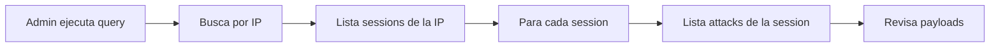

# Especificación Funcional: Base de Datos

## 1. Propósito

Define qué datos captura el sistema, cómo se almacenan, quién los accede y cuánto tiempo se retienen.

## 2. Glosario de Dominio

| Término | Definición | Ejemplo |
|---------|------------|---------|
| **Attack** | Interacción clasificada como maliciosa con un honeypot. Clasificada por severidad (low/medium/high/critical) | Login attempt con credenciales comunes |
| **Session** | Grupo de attacks del mismo source_ip dentro de una ventana de 30 minutos | 15 comandos SSH en 10 minutos |
| **Payload** | Datos enviados por el atacante: body HTTP, comando SSH, query SQL, comando FTP | `SELECT * FROM users` |
| **Severity** | Nivel de amenaza clasificado por el sistema | low = scan, critical = explotación activa |
| **IOC** | Indicador de Compromiso: patrón identificable de actividad maliciosa | IP que ejecuta `SELECT * FROM users` |
| **Retención** | Período de tiempo que los datos se mantienen antes de ser eliminados | 90 días (default) |
| **Purge** | Eliminación automática de registros antiguos | DELETE WHERE created_at < date('now', '-90 days') |

> **Regla:** "Attack" se refiere solo a interacciones clasificadas como maliciosas, no a todo tráfico que toca el honeypot.

## 3. Casos de Uso

### 3.1 CU-004: Registrar un Ataque
- **ID:** CU-004
- **Actor:** Honeypot (automático)
- **Precondiciones:** Conexión SQLite activa
- **Postcondiciones:** Attack registrado en tabla `attacks`
- **Flujo Principal:**
  1. Honeypot recibe interacción de atacante
  2. Clasifica la severidad del payload
  3. Busca sesión activa para el source_ip
  4. Si no existe sesión, crea una nueva
  5. Inserta registro en `attacks` con session_id
  6. Actualiza `attack_count` en la sesión
- **Flujos Alternativos:**
  - [Sesión expirada]: Crea nueva sesión
  - [SQLite locked]: Reintenta 3 veces con backoff
- **Flujos de Excepción:**
  - [SQLite corrupto]: Log error, intenta recuperación, notifica admin

### 3.2 CU-005: Generar Reporte Diario
- **ID:** CU-005
- **Actor:** Pipeline nocturno (automático)
- **Precondiciones:** Datos del día existen en SQLite
- **Postcondiciones:** Reporte HTML generado y publicado
- **Flujo Principal:**
  1. Pipeline ejecuta query: `SELECT * FROM attacks WHERE date(created_at) = ?`
  2. Agrupa por source_ip
  3. Calcula estadísticas (total, unique IPs, top IPs)
  4. Envía a LLM para análisis
  5. Genera Markdown con resultados
  6. Convierte a HTML
  7. Escribe en `blog/{date}.html`
  8. Registra en tabla `reports`
- **Flujos Alternativos:**
  - [No hay ataques]: Genera reporte vacío "No attacks recorded"
  - [LLM falla]: Genera reporte con análisis básico (sin LLM)

### 3.3 CU-006: Limpiar Datos Antiguos
- **ID:** CU-006
- **Actor:** Pipeline nocturno (automático)
- **Precondiciones:** Tablas `attacks` y `sessions` tienen datos
- **Postcondiciones:** Registros más antiguos que `DATA_RETENTION_DAYS` eliminados
- **Flujo Principal:**
  1. Calcula fecha de corte: `date('now', '-{retention_days} days')`
  2. Elimina attacks donde `created_at < corte`
  3. Elimina sessions donde `ended_at < corte` y no tienen attacks activos
  4. Registra cantidad de registros eliminados
- **Flujos Alternativos:**
  - [No hay datos antiguos]: No hace nada, log informativo

### 3.4 CU-007: Consultar Estadísticas
- **ID:** CU-007
- **Actor:** Administrador (manual o dashboard)
- **Precondiciones:** Datos existen en SQLite
- **Postcondiciones:** Estadísticas retornadas
- **Flujo Principal:**
  1. Admin ejecuta query o accede a `/admin/stats`
  2. Sistema calcula: attacks hoy, sesiones activas, top IPs
  3. Retorna JSON con estadísticas

## 4. Reglas de Negocio

### 4.1 RN-005: Cada ataque DEBE tener severidad asignada
- **ID:** RN-005
- **Descripción:** Todo registro en `attacks` DEBE tener un campo `severity` válido
- **Invariante:** severity IN ('low', 'medium', 'high', 'critical')
- **Validación:** CHECK constraint en la tabla
- **Ejemplo:** `severity: 'high'` para un login attempt con credenciales comunes

### 4.2 RN-006: Las sesiones se agrupan por IP y ventana de 30 minutos
- **ID:** RN-006
- **Descripción:** Si hay más de 30 minutos entre dos attacks del mismo IP, se crea una nueva sesión
- **Invariante:** Cada attack DEBE pertenecer a exactamente una sesión
- **Validación:** Al insertar attack, verificar si hay sesión activa para la IP
- **Ejemplo:** IP 1.2.3.4 tiene 5 attacks a las 14:00 → sesión 1. Tiene 3 attacks a las 15:00 → sesión 2

### 4.3 RN-007: La retención de datos es configurable
- **ID:** RN-007
- **Descripción:** El período de retención DEBE ser configurable vía variable de entorno
- **Invariante:** `DATA_RETENTION_DAYS` DEBE ser un entero positivo
- **Validación:** Parse Int, verificar > 0
- **Ejemplo:** `DATA_RETENTION_DAYS=30` elimina registros de hace más de 30 días

### 4.4 RN-008: El purge se ejecuta después de cada reporte
- **ID:** RN-008
- **Descripción:** Después de generar el reporte diario, se ejecuta el purge de datos antiguos
- **Invariante:** El purge DEBE ejecutarse exactamente una vez por día
- **Validación:** Log con timestamp y cantidad de registros eliminados
- **Ejemplo:** "Purge complete: 1,234 records deleted (older than 90 days)"

## 5. Flujos de Usuario

### 5.1 Flujo: Administrador revisa datos de un atacante específico

- **Descripción:** Investigación forense de un atacante específico
- **Pasos detallados:**
  1. Admin ejecuta `SELECT * FROM sessions WHERE source_ip = ?`
  2. Para cada session, ejecuta `SELECT * FROM attacks WHERE session_id = ?`
  3. Revisa payloads y respuestas
  4. Identifica patrones de ataque

## 6. Invariantes del Dominio

| ID | Invariante | Verificación |
|----|------------|--------------|
| INV-005 | Un attack NUNCA puede existir sin una session asociada | FK constraint en attacks.session_id |
| INV-006 | attack_count en sessions DEBE coincidir con el número real de attacks | CHECK: attack_count = COUNT(attacks) |
| INV-007 | Los timestamps de attacks DEBEN estar dentro del rango de su session | CHECK: created_at BETWEEN started_at AND ended_at OR ended_at IS NULL |
| INV-008 | Un reporte NUNCA debe ser sobrescrito | UNIQUE constraint en report_date |

## 7. Restricciones de Negocio

### 7.1 Capacidad
- Máximo de attacks por día: ~10,000 (depende de tráfico)
- Tamaño estimado por attack: ~500 bytes
- Tamaño máximo de DB: 1GB (configurable)
- Retención default: 90 días

### 7.2 Rendimiento
- Inserción de attack: < 10ms
- Query de reporte diario: < 1s
- Purge de datos antiguos: < 30s

### 7.3 Integridad
- Los datos de attacks NO deben ser editables manualmente
- Los reportes generados NO deben ser modificados
- Los timestamps DEBEN ser en UTC

## 8. Métricas de Éxito

- **Tasa de captura:** 100% de interacciones con honeypots se registran
- **Integridad de datos:** 0 corrupciones de SQLite al mes
- **Tiempo de purge:** < 30s para 90 días de datos
- **Disponibilidad de queries:** < 100ms para cualquier query de lectura

## 9. No Funcional (desde perspectiva de usuario)

- **Tiempo de respuesta:** < 1s para generar reporte diario
- **Disponibilidad:** 100% (SQLite es local, sin dependencias de red)
- **Usabilidad:** Queries SQL directas o API REST para consultas

## 10. Changelog

| Versión | Fecha | Cambios |
|---------|-------|---------|
| 1.0.0 | 2026-06-12 | Versión inicial |
