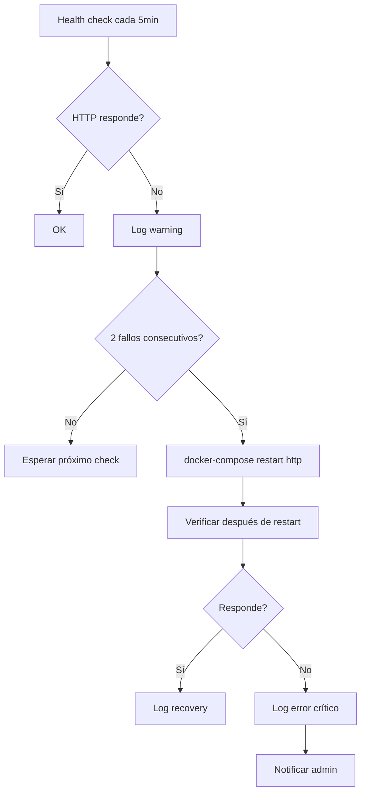

# Especificación Funcional: Cron Setup

## 1. Propósito

Define las tareas programadas que mantienen el sistema funcionando: generación de reportes, monitoreo de salud, mantenimiento de base de datos y rotación de logs.

## 2. Glosario de Dominio

| Término | Definición | Ejemplo |
|---------|------------|---------|
| **Cron Job** | Tarea programada que se ejecuta a intervalos regulares | Pipeline nocturno a las 00:00 |
| **Health Check** | Verificación periódica de que todos los servicios están activos | Cada 5 minutos: HTTP, SSH, FTP, MySQL, Ollama |
| **Log Rotation** | Proceso de mover y comprimir logs antiguos | Diario: logs de >7 días se comprimen |
| **DB Maintenance** | Optimización y backup de la base de datos | Semanal: VACUUM + backup |
| **Guard Clause** | Verificación de prerequisitos antes de ejecutar un script | Verificar que Ollama está corriendo antes del pipeline |

> **Regla:** "Health check" se refiere a la verificación de servicios del honeypot, no a la verificación de la salud del hardware.

## 3. Casos de Uso

### 3.39 CU-037: Ejecutar Pipeline Nocturno
- **ID:** CU-039
- **Actor:** Cron (automático)
- **Precondiciones:** Hora actual es 00:00
- **Postcondiciones:** Pipeline ejecutado, log generado
- **Flujo Principal:**
  1. Cron dispara `scripts/nightly.sh` a las 00:00
  2. Script verifica: Ollama activo, SQLite accesible
  3. Ejecuta `node src/pipeline/nightly.js`
  4. Genera log con timestamp y resultado
- **Flujos Alternativos:**
  - [Ollama no activo]: Pipeline continúa en modo degradado
  - [Script falla]: Log de error, notificación si hay webhook configurado

### 3.40 CU-038: Verificar Salud del Sistema
- **ID:** CU-40
- **Actor:** Cron (automático)
- **Precondiciones:** Ninguna
- **Postcondiciones:** Estado de cada servicio verificado
- **Flujo Principal:**
  1. Cron dispara `scripts/health-check.sh` cada 5 minutos
  2. Verifica HTTP honeypot (curl localhost:80)
  3. Verifica SSH honeypot (nc -z localhost 2222)
  4. Verifica FTP honeypot (nc -z localhost 2121)
  5. Verifica MySQL honeypot (nc -z localhost 3306)
  6. Verifica Ollama (curl localhost:11434/api/tags)
  7. Registra estado en log
- **Flujos Alternativos:**
  - [Servicio no responde]: Intenta restart vía docker-compose
  - [Restart falla]: Log error, notificación

### 3.41 CU-039: Mantenimiento de Base de Datos
- **ID:** CU-41
- **Actor:** Cron (automático, semanal)
- **Precondiciones:** Domingo a las 02:00
- **Postcondiciones:** DB optimizada, backup creado
- **Flujo Principal:**
  1. Cron dispara `scripts/db-maintenance.sh`
  2. Ejecuta VACUUM en SQLite
  3. Crea backup: `data/sentinel-{date}.db.gz`
  4. Elimina backups de >30 días
  5. Registra resultado en log
- **Flujos Alternativos:**
  - [VACUUM falla]: Log warning, continuar (no crítico)
  - [Disco lleno]: Log error, notificar admin

### 3.42 CU-040: Rotar Logs
- **ID:** CU-42
- **Actor:** Cron (automático, diario)
- **Precondiciones:** Logs existentes
- **Postcondiciones:** Logs rotados y comprimidos
- **Flujo Principal:**
  1. Cron dispara `scripts/log-rotation.sh` a las 01:00
  2. Mueve logs de >7 días a `logs/archive/`
  3. Comprime logs de >7 días (.gz)
  4. Elimina logs de >30 días
  5. RegistraActivityResult
- **Flujos Alternativos:**
  - [No hay logs]: No hace nada

### 3.43 CU-041: Instalar Cron Jobs
- **ID:** CU-43
- **Actor:** Administrador (una vez)
- **Precondiciones:** Sistema desplegado
- **Postcondiciones:** Cron jobs instalados
- **Flujo Principal:**
  1. Admin ejecuta `scripts/setup-cron.sh`
  2. Script instala los 4 cron jobs
  3. Verifica instalación con `crontab -l`
- **Flujos Alternativos:**
  - [Cron no disponible]: Instrucciones manuales

## 4. Reglas de Negocio

### 4.1 RN-039: El health check DEBE correr cada 5 minutos
- **ID:** RN-039
- **Descripción:** El intervalo de health check es fijo en 5 minutos
- **Invariante:** `*/5 * * * *` en crontab
- **Validación:** Verificar crontab después de setup
- **Ejemplo:** 288 health checks por día

### 4.2 RN-040: Los scripts DEBEN usar rutas absolutas
- **ID:** RN-040
- **Descripción:** Todos los scripts DEBEN usar rutas absolutas para evitar dependencia de PATH
- **Invariante:** Ningún script usa `cd` sin ruta absoluta
- **Validación:** Auditar scripts, verificar rutas
- **Ejemplo:** `node /opt/sentinel/src/pipeline/nightly.js` (no `node src/pipeline/nightly.js`)

### 4.3 RN-041: El health check DEBE intentar restart automático
- **ID:** RN-041
- **Descripción:** Si un honeypot falla, el health check DEBE intentar restart
- **Invariante:** `docker-compose restart [servicio]` después de 2 fallos consecutivos
- **Validación:** Test: detener honeypot, verificar restart en 10 minutos
- **Ejemplo:** HTTP no responde → restart → verifica → OK

### 4.4 RN-042: Los logs DEBEN tener timestamp
- **ID:** RN-042
- **Descripción:** Cada línea de log DEBE incluir timestamp ISO 8601
- **Invariante:** Formato: `[YYYY-MM-DD HH:MM:SS] [LEVEL] message`
- **Validación:** Verificar formato en logs existentes
- **Ejemplo:** `[2026-06-12 00:00:01] [INFO] Pipeline started`

### 4.5 RN-043: El backup DEBE verificarse
- **ID:** RN-043
- **Descripción:** El backup semanal DEBE ser testeado con restore
- **Invariante:** Al menos 1 backup al mes se verifica
- **Validación:** Test restore a DB temporal
- **Ejemplo:** `sqlite3 /tmp/test.db < sentinel-backup.sql`

## 5. Flujos de Usuario

### 5.1 Flujo: Health check encuentra servicio caído

- **Descripción:** Flujo de auto-recuperación del sistema
- **Pasos detallados:**
  1. Health check detecta servicio caído
  2. Registra warning
  3. Si falla 2 veces seguidas, intenta restart
  4. Verifica después del restart
  5. Si no responde, notifica admin

## 6. Invariantes del Dominio

| ID | Invariante | Verificación |
|----|------------|--------------|
| INV-039 | Health check corre cada 5 minutos | Verificar crontab |
| INV-040 | Scripts usan rutas absolutas | Auditar scripts |
| INV-041 | Restart automático después de 2 fallos | Test: detener servicio |
| INV-042 | Logs tienen timestamp ISO 8601 | Verificar logs |
| INV-043 | Backup se verifica mensualmente | Test restore |

## 7. Restricciones de Negocio

### 7.1 Frecuencia
- Health check: cada 5 minutos
- Pipeline nocturno: diario a las 00:00
- Log rotation: diario a las 01:00
- DB maintenance: semanal (dom 02:00)

### 7.2 Rendimiento
- Health check: < 30 segundos
- Pipeline: < 5 minutos
- DB maintenance: < 10 minutos
- Log rotation: < 1 minuto

### 7.3 Fiabilidad
- Si un cron job falla 3 veces, notificar admin
- Los logs se retienen 30 días
- Los backups se retienen 30 días

## 8. Métricas de Éxito

- **Tasa de éxito de cron jobs:** > 99%
- **Tiempo de health check:** < 30 segundos
- **Tiempo de pipeline:** < 3 minutos
- **Auto-recuperación:** > 90% de servicios se recuperan sin intervención manual

## 9. No Funcional (desde perspectiva de usuario)

- **Mantenimiento:** Revisión semanal de logs (~15 min)
- **Configuración:** Una vez durante setup
- **Monitoreo:** Automático, sin intervención manual

## 10. Changelog

| Versión | Fecha | Cambios |
|---------|-------|---------|
| 1.0.0 | 2026-06-12 | Versión inicial |
