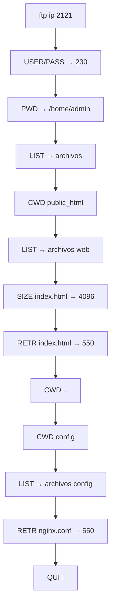

# Especificación Funcional: Honeypot FTP

## 1. Propósito

Simula un servidor FTP real con directorios y archivos ficticios, capturando comandos FTP y evitando que el atacante descargue o suba archivos reales.

## 2. Glosario de Dominio

| Término | Definición | Ejemplo |
|---------|------------|---------|
| **Virtual Filesystem** | Sistema de archivos en memoria, no real, que simula un directorio FTP | `/public_html/index.html` |
| **Listing** | Listado de archivos y directorios retornado por `LIST` | `-rw-r--r-- 1 admin admin 4096 Jun 01 index.html` |
| **FTP Session** | Conexión FTP mantenida desde el atacante hasta `QUIT` | Duración: hasta 10min de inactividad |
| **Comando FTP** | Instrucción enviada por el cliente FTP | `LIST`, `RETR`, `CWD`, `PWD` |

> **Regla:** "Listing" se refiere al listado de archivos en el directorio virtual, no a un directorio real.

## 3. Casos de Uso

### 3.1 CU-017: Conexión FTP al Honeypot
- **ID:** CU-017
- **Actor:** Atacante (cliente FTP)
- **Precondiciones:** FTP honeypot activo en puerto 2121
- **Postcondiciones:** Conexión establecida, greeting presentado
- **Flujo Principal:**
  1. Atacante ejecuta `ftp <ip> 2121`
  2. Honeypot retorna greeting: `220 Welcome to FTP server`
  3. Atacante envía `USER admin`
  4. Honeypot retorna `331 Password required`
  5. Atacante envía `PASS admin`
  6. Honeypot retorna `230 Login successful`
- **Flujos Alternativos:**
  - [Credenciales diferentes]: Siempre acepta (230 Login successful)

### 3.20 CU-018: Listado de Directorios
- **ID:** CU-018
- **Actor:** Atacante
- **Precondiciones:** Sesión FTP autenticada
- **Postcondiciones:** Listing registrado en SQLite
- **Flujo Principal:**
  1. Atacante envía `PWD` → `257 "/home/admin"`
  2. Atacante envía `LIST`
  3. Honeypot retorna listing del directorio actual
  4. Listing registrado en SQLite
- **Flujos Alternativos:**
  - [Directorio no existe]: `550 Directory not found`

### 3.21 CU-019: Navegación de Directorios
- **ID:** CU-019
- **Actor:** Atacante
- **Precondiciones:** Sesión FTP autenticada
- **Postcondiciones:** Directorio actual cambiado
- **Flujo Principal:**
  1. Atacante envía `CWD public_html`
  2. Honeypot retorna `250 Directory changed`
  3. Atacante envía `PWD` → `257 "/home/admin/public_html"`
- **Flujos Alternativos:**
  - [Directorio no existe]: `550 Directory not found`
  - [CWD a `..`]: Retrocede un nivel

### 3.22 CU-020: Intento de Descarga
- **ID:** CU-020
- **Actor:** Atacante
- **Precondiciones:** Sesión FTP autenticada, conoce nombre de archivo
- **Postcondiciones:** Intento registrado, descarga fallida
- **Flujo Principal:**
  1. Atacante envía `SIZE config/nginx.conf`
  2. Honeypot retorna `213 1024` (tamaño ficticio)
  3. Atacante envía `RETR config/nginx.conf`
  4. Honeypot retorna `550 Permission denied`
  5. Intento registrado como severity: medium
- **Flujos Alternativos:**
  - [RETR a directorio]: `550 Is a directory`

### 3.23 CU-021: Intento de Subida
- **ID:** CU-021
- **Actor:** Atacante
- **Precondiciones:** Sesión FTP autenticada
- **Postcondiciones:** Intento registrado, subida fallida
- **Flujo Principal:**
  1. Atacante envía `STOR malware.sh`
  2. Honeypot retorna `550 Permission denied`
  3. Intento registrado como severity: high
- **Flujos Alternativos:**
  - [STOR con nombre sospechoso]: severity: critical

### 3.24 CU-022: Finalización de Sesión
- **ID:** CU-024
- **Actor:** Atacante o Sistema
- **Precondiciones:** Sesión FTP activa
- **Postcondiciones:** Sesión registrada como terminada
- **Flujo Principal:**
  1. Atacante envía `QUIT`
  2. Honeypot retorna `221 Goodbye`
  3. Sesión cerrada, registrada en SQLite

## 4. Reglas de Negocio

### 4.1 RN-019: Cualquier credencial es aceptada
- **ID:** RN-019
- **Descripción:** El honeypot FTP acepta cualquier combinación USER/PASS
- **Invariante:** La autenticación SIEMPRE es exitosa
- **Validación:** Test con 100 combinaciones, todas pasan
- **Ejemplo:** `USER root` `PASS ""` → 230 Login successful

### 4.2 RN-020: `RETR` SIEMPRE falla
- **ID:** RN-020
- **Descripción:** Ningún archivo se puede descargar del honeypot
- **Invariante:** `RETR` siempre retorna `550 Permission denied`
- **Validación:** Test: intentar descargar cada archivo del listing
- **Ejemplo:** `RETR index.html` → `550 Permission denied`

### 4.3 RN-021: `STOR` SIEMPRE falla
- **ID:** RN-021
- **Descripción:** Ningún archivo se puede subir al honeypot
- **Invariante:** `STOR` siempre retorna `550 Permission denied`
- **Validación:** Test: intentar subir archivos
- **Ejemplo:** `STOR test.txt` → `550 Permission denied`

### 4.4 RN-022: El listing es consistente entre conexiones
- **ID:** RN-022
- **Descripción:** Cada conexión al mismo directorio retorna el mismo listing
- **Invariante:** El virtual filesystem no cambia entre sesiones
- **Validación:** Test: dos conexiones al mismo directorio, verificar mismo listing
- **Ejemplo:** `LIST` en `/public_html` siempre retorna los mismos 3 archivos

### 4.5 RN-023: `SIZE` retorna tamaño ficticio
- **ID:** RN-023
- **Descripción:** `SIZE` retorna un tamaño predefinido para cada archivo
- **Invariante:** El tamaño es consistente para el mismo archivo
- **Validación:** Test: `SIZE` del mismo archivo 10 veces, mismo resultado
- **Ejemplo:** `SIZE index.html` → `213 4096`

## 5. Flujos de Usuario

### 5.1 Flujo: Atacante explora el servidor FTP

- **Descripción:** Flujo típico de reconocimiento y exfiltración fallida
- **Pasos detallados:**
  1. Atacante se conecta con credenciales genéricas
  2. Navega directorios buscando datos interesantes
  3. Intenta descargar archivos de configuración
  4. Todas las descargas fallen (550)
  5. Atacante se rinde y cierra conexión

## 6. Invariantes del Dominio

| ID | Invariante | Verificación |
|----|------------|--------------|
| INV-019 | La autenticación FTP SIEMPRE es exitosa | Test automatizado |
| INV-020 | `RETR` NUNCA retorna el contenido del archivo | Test: verificar que respuesta es 550 |
| INV-021 | `STOR` NUNCA crea archivos | Test: verificar que archivos no persisten |
| INV-022 | El listing ES consistente entre conexiones | Test: 2 conexiones, mismo listing |
| INV-023 | Cada comando se registra en SQLite | Verificar DB después de cada comando |

## 7. Restricciones de Negocio

### 7.1 Experiencia del Atacante
- El listing DEBE parecer un servidor real (permisos, tamaños, fechas)
- Los nombres de archivo DEBEN ser creíbles (`nginx.conf`, `backup.tar.gz`)
- El directorio `secrets/` DEBE contener `.htpasswd` para atraer al atacante
- `QUIT` DEBE cerrar limpiamente (no drop de conexión)

### 7.2 Captura de Datos
- Cada comando FTP DEBE registrarse: comando, argumento, código de respuesta, timestamp
- `LIST` DEBE registrar el listing completo retornado
- `RETR` DEBE registrarse como severity: medium
- `STOR` DEBE registrarse como severity: high

### 7.3 Seguridad del Honeypot
- NO debe permitir transferencia real de archivos
- NO debe exponer el filesystem del host
- NO debe ejecutar scripts del atacante
- Puerto 2121 (no 21) para evitar conflicto con FTP real

## 8. Métricas de Éxito

- **Tiempo de permanencia:** > 3 minutos promedio
- **Comandos por sesión:** 5-15 comandos promedio
- **Intentos de descarga:** 2-5 por sesión promedio
- **Tasa de detección:** 0% de atacantes detectan honeypot

## 9. No Funcional (desde perspectiva de usuario)

- **Compatibilidad:** FileZilla, WinSCP, curl, lftp, navegadores FTP
- **Modo pasivo:** Soportado (EPSV/PASV)
- **Latencia:** < 100ms para comandos

## 10. Changelog

| Versión | Fecha | Cambios |
|---------|-------|---------|
| 1.0.0 | 2026-06-12 | Versión inicial |
