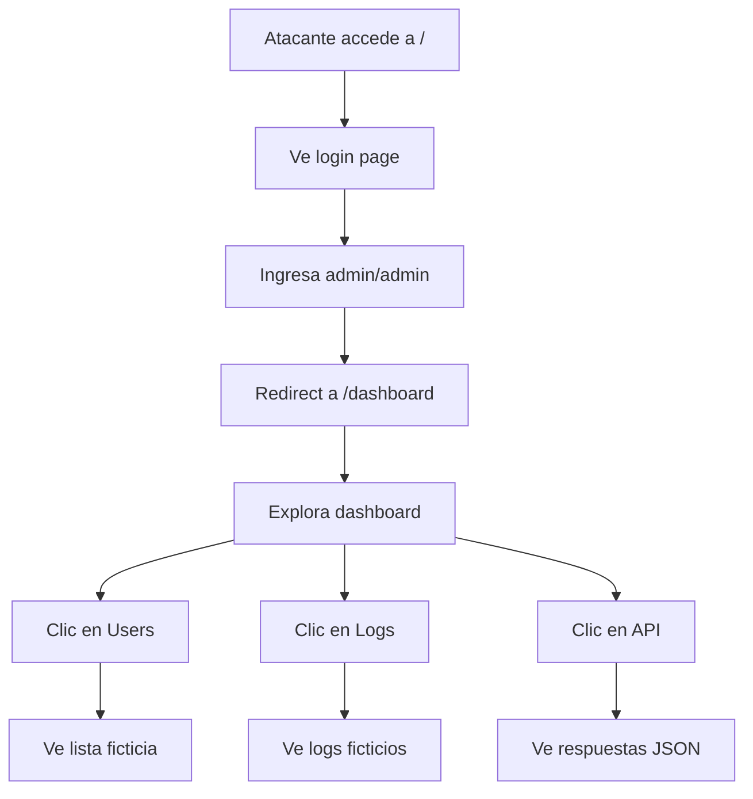

# Especificación Funcional: Honeypot HTTP

## 1. Propósito

Simula un panel de administración web realista que captura intentos de acceso, payloads HTTP y genera respuestas creíbles para mantener al atacante enganchado.

## 2. Glosario de Dominio

| Término | Definición | Ejemplo |
|---------|------------|---------|
| **Admin Panel** | Interfaz web falsa que simula un panel de administración de servidor | Login page, dashboard, API endpoints |
| **Login Page** | Página de inicio de sesión que captura credenciales intentadas | Formulario con campos user/password |
| **Dashboard** | Panel principal visible después de login exitoso | Muestra stats ficticios, logs, configuración |
| **Dual Mode** | Login que captura credenciales Y simula dashboard si coinciden con predefinidas | user=admin, pass=admin → dashboard |
| **Payload HTTP** | Body, headers o query parameters enviados por el atacante | `{"user":"admin","pass":"123456"}` |
| **Rate Limiting** | Limitación de requests por IP para evitar saturación | 60 requests/min por IP |

> **Regla:** "Login" se refiere al proceso de autenticación en el panel falso, no a la autenticación real del sistema.

## 3. Casos de Uso

### 3.1 CU-008: Acceso a Página de Login
- **ID:** CU-008
- **Actor:** Visitante (potencial atacante)
- **Precondiciones:** HTTP honeypot está activo en puerto configurado
- **Postcondiciones:** Visitante ve formulario de login falso
- **Flujo Principal:**
  1. Visitante accede a `http://<ip>:80/`
  2. Sistema retorna HTML con formulario de login
  3. Formulario muestra campos: username, password, botón "Sign In"
  4. Credenciales predefinidas mostradas en small text: "demo: admin/admin"
  5. Visitante ingresa credenciales y submit
- **Flujos Alternativos:**
  - [Rate limit excedido]: Retorna 429 con HTML de "Too Many Requests"

### 3.2 CU-009: Intento de Login
- **ID:** CU-009
- **Actor:** Visitante
- **Precondiciones:** Visitante en página de login
- **Postcondiciones:** Credenciales registradas en SQLite, respuesta apropiada
- **Flujo Principal:**
  1. Visitante envía POST /login con username y password
  2. Sistema registra credenciales en attacks (severity: medium)
  3. Si username=admin AND password=admin:
     a. Crea sesión HTTP con cookie `sentinel_session`
     b. Redirect a `/dashboard`
  4. Si credenciales incorrectas:
     a. Retorna HTML con mensaje "Invalid credentials"
     b. Permanece en página de login
- **Flujos Alternativos:**
  - [Campos vacíos]: Retorna HTML de error "Please fill all fields"
  - [SQL injection en campos]: Registra como severity: high, retorna error genérico
  - [XSS en campos]: Registra como severity: critical, retorna error genérico

### 3.10 CU-010: Acceso al Dashboard
- **ID:** CU-010
- **Actor:** Visitante autenticado
- **Precondiciones:** Login exitoso, cookie de sesión válida
- **Postcondiciones:** Visitante ve panel de administración falso
- **Flujo Principal:**
  1. Visitante accede a `/dashboard`
  2. Sistema verifica cookie de sesión
  3. Si válida: retorna HTML del dashboard
  4. Dashboard muestra: "Active Users", "Recent Logs", "Server Status"
  5. Todos los datos son ficticios y consistentes
- **Flujos Alternativos:**
  - [Sin cookie]: Redirect a `/`
  - [Cookie expirada]: Redirect a `/` con mensaje "Session expired"

### 3.11 CU-011: Acceso a API Endpoints
- **ID:** CU-011
- **Actor:** Visitante (scripts, herramientas)
- **Precondiciones:** HTTP honeypot activo
- **Postcondiciones:** Request registrado, respuesta ficticia retornada
- **Flujo Principal:**
  1. Visitante envía request a `/api/v1/*`
  2. Sistema registra el request completo (method, path, body, headers)
  3. Retorna JSON con datos ficticios según el endpoint
  4. Ejemplo: `GET /api/v1/users` → `[{"id":1,"name":"admin","role":"superuser"}]`
- **Flujos Alternativos:**
  - [Endpoint no existe]: Retorna 404 con JSON `{"error": "Not found"}`
  - [Body con payload sospechoso]: Registra como severity: high

### 3.12 CU-012: Request a Cualquier Path
- **ID:** CU-012
- **Actor:** Visitante (scanners, bots)
- **Precondiciones:** HTTP honeypot activo
- **Postcondiciones:** Request registrado como attack
- **Flujo Principal:**
  1. Visitante envía request a path no definido
  2. Sistema registra el request como severity: low
  3. Retorna 404 page falso o redirect a `/`
- **Flujos Alternativos:**
  - [Path contiene patrón de exploit]: Registra como severity: critical

## 4. Reglas de Negocio

### 4.1 RN-009: El login NUNCA debe retornar 401 o 403
- **ID:** RN-009
- **Descripción:** Todas las respuestas de login DEBEN ser HTTP 200 con HTML de error o redirect
- **Invariante:** Status code de login SIEMPRE es 200
- **Validación:** Test: enviar credenciales incorrectas, verificar status 200
- **Ejemplo:** Credenciales incorrectas → 200 con HTML "Invalid credentials" (no 401)

### 4.2 RN-010: Las credenciales admin/admin son las únicas válidas
- **ID:** RN-010
- **Descripción:** Solo user=admin, pass=admin activan el dashboard
- **Invariante:** Cualquier otra combinación muestra error
- **Validación:** Test con 100 combinaciones aleatorias, solo admin/admin pasa
- **Ejemplo:** "root"/"toor" → error; "admin"/"admin" → dashboard

### 4.13 RN-011: Rate limiting DEBE aplicarse por IP
- **ID:** RN-011
- **Descripción:** Cada IP tiene máximo 60 requests por minuto (configurable)
- **Invariante:** Si una IP excede el límite, recibe 429
- **Validación:** Test: enviar 61 requests en 1 minuto, verificar 429 en la 61
- **Ejemplo:** 60 requests → 200; request 61 → 429

### 4.14 RN-012: Los datos del dashboard DEBEN ser consistentes
- **ID:** RN-012
- **Descripción:** Los datos ficticios del dashboard deben ser los mismos en cada visita
- **Invariante:** "Active Users" siempre muestra entre 3-5 usuarios ficticios
- **Validación:** Test: acceder al dashboard 10 veces, verificar mismos datos
- **Ejemplo:** Dashboard siempre muestra "admin", "operator", "viewer" como usuarios

### 4.15 RN-013: El header Server DEBE ser genérico
- **ID:** RN-013
- **Descripción:** El header `Server` NO debe revelar que es un honeypot
- **Invariante:** Server header DEBE ser "Apache/2.4.41 (Ubuntu)" o similar
- **Validación:** Test: verificar header en cada response
- **Ejemplo:** `Server: Apache/2.4.41 (Ubuntu)` (no "Node.js" ni "Fastify")

## 5. Flujos de Usuario

### 5.1 Flujo: Atacante explora el panel admin

- **Descripción:** Flujo típico de un atacante que accede al panel
- **Pasos detallados:**
  1. Atacante encuentra el honeypot (scan de puertos)
  2. Accede al puerto 80, ve página de login
  3. Prueba credenciales comunes (admin/admin funciona)
  4. Explora el dashboard durante 5-10 minutos
  5. Intenta acceder a API endpoints
  6. Todo se registra en SQLite

## 6. Invariantes del Dominio

| ID | Invariante | Verificación |
|----|------------|--------------|
| INV-009 | El login SIEMPRE retorna 200 (nunca 401/403) | Test automatizado |
| INV-010 | El dashboard SOLO es accesible post-login exitoso | Test: acceder sin cookie → redirect |
| INV-011 | Cada request HTTP DEBE registrarse en SQLite | Verificar count en DB después de requests |
| INV-012 | Los datos del dashboard SON consistentes entre visits | Test: 10 accesses, mismos datos |
| INV-013 | El header Server NO revela tecnología real | Test: verificar header |

## 7. Restricciones de Negocio

### 7.1 Experiencia del Atacante
- El atacante DEBE sentir que está en un servidor real
- El login DEBE ser funcional (no solo decorativo)
- El dashboard DEBE tener contenido suficiente para explorar (mínimo 5 pages)
- La API DEBE retornar datos JSON realistas

### 7.2 Captura de Datos
- Cada request HTTP DEBE registrarse: method, path, headers, body, IP, user-agent
- Las credenciales intentadas DEBEN registrarse por separado
- Los payloads sospechosos DEBEN tener severity elevated

### 7.3 Seguridad del Honeypot
- El honeypot NO debe permitir upload de archivos
- NO debe ejecutar código del atacante (no eval, no exec)
- NO debe redirigir a servicios externos

## 8. Métricas de Éxito

- **Tiempo de permanencia del atacante:** > 5 minutos promedio en el dashboard
- **Tasa de captura de credenciales:** 100% de login attempts registrados
- **Detección de payloads maliciosos:** 100% de SQL injection/XSS detectados
- **Falso positivo en rate limiting:** < 1% de visitantes legítimos bloqueados

## 9. No Funcional (desde perspectiva de usuario)

- **Tiempo de respuesta:** < 200ms para páginas estáticas
- **Compatibilidad:** Funciona en Chrome, Firefox, Safari
- **Responsive:** Se ve bien en móvil y desktop
- **Accesibilidad:** Contraste adecuado, labels en formularios

## 10. Changelog

| Versión | Fecha | Cambios |
|---------|-------|---------|
| 1.0.0 | 2026-06-12 | Versión inicial |
