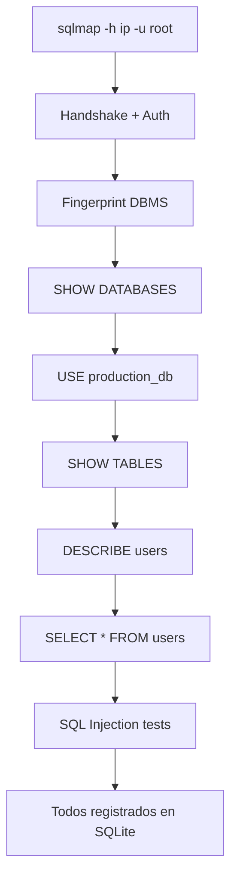

# Especificación Funcional: Honeypot MySQL

## 1. Propósito

Simula un servidor MySQL real que responde al handshake de protocolo, acepta cualquier autenticación y responde a queries SQL básicas con datos ficticios, capturando todo el tráfico SQL del atacante.

## 2. Glosario de Dominio

| Término | Definición | Ejemplo |
|---------|------------|---------|
| **Handshake** | Primer intercambio de packets entre cliente y servidor MySQL | Server Greeting + Auth Response |
| **Wire Protocol** | Formato binario de comunicación MySQL | Packets con header de 4 bytes + payload |
| **Query SQL** | Instrucción SQL enviada por el atacante | `SELECT * FROM users` |
| **Fake Database** | Base de datos ficticia en memoria con tablas y datos predefinidos | `production_db` con 5 tablas |
| **MySQL Session** | Conexión TCP mantenida que ejecuta múltiples queries | Duración: hasta 8 horas |

> **Regla:** "Query" se refiere a cualquier instrucción SQL enviada al honeypot, sin importar si es válida o no.

## 3. Casos de Uso

### 3.25 CU-023: Conexión MySQL al Honeypot
- **ID:** CU-025
- **Actor:** Atacante (cliente MySQL)
- **Precondiciones:** MySQL honeypot activo en puerto 3306
- **Postcondiciones:** Handshake completado, sesión autenticada
- **Flujo Principal:**
  1. Atacante ejecuta `mysql -h <ip> -u root -p`
  2. Honeypot envía Server Greeting (versión, scramble, capabilities)
  3. Atacante envía Auth Response (cualquier password)
  4. Honeypot retorna OK packet
  5. Sesión MySQL lista para queries
- **Flujos Alternativos:**
  - [mysql client]: Handshake completo, charset negotiation
  - [sqlmap]: Handshake completo, detección de DBMS

### 3.26 CU-024: Ejecución de SELECT
- **ID:** CU-026
- **Actor:** Atacante
- **Precondiciones:** Sesión MySQL autenticada
- **Postcondiciones:** Query registrada, datos ficticios retornados
- **Flujo Principal:**
  1. Atacante envía `SELECT * FROM users`
  2. Honeypot busca tabla "users" en la DB ficticia
  3. Retorna ResultSet con datos ficticios (máx 10 rows)
  4. Query registrada en SQLite
- **Flujos Alternativos:**
  - [Tabla no existe]: `ERROR 1146 (42S02): Table 'production_db.x' doesn't exist`
  - [SELECT sin FROM]: Error de syntax

### 3.27 CU-025: Ejecución de DDL/DML
- **ID:** CU-027
- **Actor:** Atacante
- **Precondiciones:** Sesión MySQL autenticada
- **Postcondiciones:** Query registrada, respuesta OK
- **Flujo Principal:**
  1. Atacante envía `INSERT INTO users VALUES (...)`
  2. Honeypot retorna `Query OK, 0 rows affected`
  3. Query registrada en SQLite
- **Flujos Alternativos:**
  - [CREATE TABLE]: `Query OK, 0 rows affected`
  - [DROP TABLE]: `Query OK, 0 rows affected` (no afecta nada real)

### 3.28 CU-026: Navegación de Metadata
- **ID:** CU-028
- **Actor:** Atacante
- **Precondiciones:** Sesión MySQL autenticada
- **Postcondiciones:** Metadata ficticia retornada
- **Flujo Principal:**
  1. Atacante envía `SHOW DATABASES`
  2. Honeypot retorna lista de DBs ficticias
  3. Atacante envía `USE production_db`
  4. Honeypot retorna `Database changed`
  5. Atacante envía `SHOW TABLES`
  6. Honeypot retorna lista de tablas ficticias
  7. Atacante envía `DESCRIBE users`
  8. Honeypot retorna estructura ficticia de la tabla
- **Flujos Alternativos:**
  - [SHOW DATABASES]: Solo retorna la DB ficticia (no information_schema real)

### 3.29 CU-027: Detección de SQL Injection
- **ID:** CU-029
- **Actor:** Atacante (sqlmap, manual)
- **Precondiciones:** Sesión MySQL autenticada
- **Postcondiciones:** Payload registrado como severity: critical
- **Flujo Principal:**
  1. Atacante envía query con patrón de SQL injection
  2. Honeypot detecta patrón (UNION, OR 1=1, etc.)
  3. Registra como severity: critical
  4. Retorna error de syntax (no revela que detectó la inyección)
- **Flujos Alternativos:**
  - [Payload obfuscado]: Análisis de patrones básicos

## 4. Reglas de Negocio

### 4.1 RN-024: Cualquier credencial es aceptada
- **ID:** RN-024
- **Descripción:** El honeypot MySQL acepta cualquier combinación user/password
- **Invariante:** La autenticación SIEMPRE es exitosa
- **Validación:** Test con mysql client y sqlmap
- **Ejemplo:** `mysql -u root -p"anything"` → autenticado

### 4.2 RN-025: `SELECT` retorna datos ficticios
- **ID:** RN-025
- **Descripción:** Cada tabla tiene un conjunto predefinido de datos ficticios
- **Invariante:** Los datos son consistentes entre queries
- **Validación:** Test: `SELECT * FROM users` ejecutado 10 veces → mismos datos
- **Ejemplo:** users siempre tiene 5 usuarios: admin, operator, viewer, test, backup

### 4.3 RN-026: DDL/DML no afecta datos reales
- **ID:** RN-026
- **Descripción:** INSERT, UPDATE, DELETE, CREATE, DROP retornan OK pero no modifican nada
- **Invariante:** El fake database es inmutable
- **Validación:** Test: INSERT seguido de SELECT → mismos datos
- **Ejemplo:** `INSERT INTO users VALUES (99,'hacker','...')` → OK; `SELECT * FROM users` → 5 users (no 6)

### 4.23 RN-027: SQL Injection se registra como critical
- **ID:** RN-027
- **Descripción:** Cualquier query con patrón de SQL injection tiene severity: critical
- **Invariante:** Patrones: UNION SELECT, OR 1=1, --, /*, ;DROP
- **Validación:** Test con 20 payloads de sqlmap, todos registrados como critical
- **Ejemplo:** `SELECT * FROM users WHERE id=1 OR 1=1` → severity: critical

### 4.4 RN-028: `SHOW DATABASES` retorna solo la DB ficticia
- **ID:** RN-028
- **Descripción:** No se exponen databases del sistema real (information_schema, etc.)
- **Invariante:** Solo se muestra `production_db`
- **Validación:** Test: `SHOW DATABASES` → solo 1 resultado
- **Ejemplo:** `SHOW DATABASES` → `production_db`

## 5. Flujos de Usuario

### 5.1 Flujo: Atacante ejecuta sqlmap

- **Descripción:** Flujo típico de sqlmap contra el honeypot
- **Pasos detallados:**
  1. sqlmap detecta MySQL 5.7
  2. Enumera databases, tablas, columnas
  3. Ejecuta payloads de SQL injection
  4. Todos los payloads se registran como severity: critical
  5. sqlmap "exito" → atacante sigue interactuando

## 6. Invariantes del Dominio

| ID | Invariante | Verificación |
|----|------------|--------------|
| INV-024 | La autenticación MySQL SIEMPRE es exitosa | Test automatizado |
| INV-025 | Los datos ficticios SON consistentes entre queries | Test: 10 SELECTs, mismos datos |
| INV-026 | DDL/DML NUNCA modifica datos reales | Test: INSERT + SELECT = mismos datos |
| INV-027 | SQL injection SIEMPRE se registra como critical | Verificar DB después de cada payload |
| INV-028 | El honeypot NUNCA ejecuta queries reales | Audit: no hay conexión a DB real |

## 7. Restricciones de Negocio

### 7.1 Experiencia del Atacante
- El handshake DEBE ser binariamente compatible con MySQL 5.7
- Los datos ficticios DEBEN parecer reales (emails, fechas, passwords hasheados)
- `DESCRIBE` DEBE mostrar tipos de datos correctos (INT, VARCHAR, TIMESTAMP)
- El server version DEBE ser `5.7.42-0ubuntu0.18.04.1`

### 7.2 Captura de Datos
- Cada query SQL DEBE registrarse completa (texto original)
- El timestamp DEBE registrarse
- SQL injection DEBE detectarse y registrarse como critical
- Las queries de metadata (SHOW, DESCRIBE) también se registran

### 7.3 Seguridad del Honeypot
- NO debe ejecutar LOAD DATA INFILE (lectura de archivos del host)
- NO debe permitir UDF (User Defined Functions)
- NO debe establecer conexiones a otras DBs
- NO debe exponer el filesystem real

## 8. Métricas de Éxito

- **Detección de sqlmap:** sqlmap no detecta el honeypot como falso
- **Queries por sesión:** 10-50 queries promedio
- **Detección de SQL injection:** 100% de payloads detectados
- **Compatible con clientes:** mysql, sqlmap, Navicat, DBeaver

## 9. No Funcional (desde perspectiva de usuario)

- **Latencia de respuesta:** < 100ms por query
- **Conexiones simultáneas:** Hasta 20
- **Charset:** utf8mb4

## 10. Changelog

| Versión | Fecha | Cambios |
|---------|-------|---------|
| 1.0.0 | 2026-06-12 | Versión inicial |
