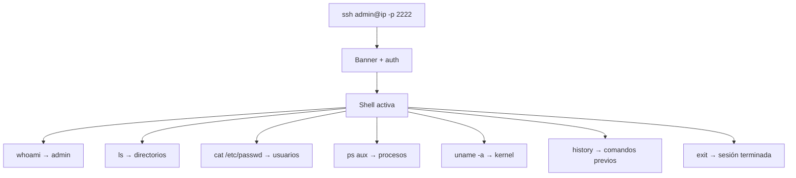

# Especificación Funcional: Honeypot SSH

## 1. Propósito

Simula un servidor SSH real que acepta cualquier credencial, proporciona una shell interactiva ficticia y registra todos los comandos ejecutados por el atacante.

## 2. Glosario de Dominio

| Término | Definición | Ejemplo |
|---------|------------|---------|
| **Fake Shell** | Interfaz de línea de comandos falsa que simula un terminal Linux | Prompt: `admin@server:~$` |
| **Banner SSH** | String presentado al cliente antes de la autenticación | `SSH-2.0-OpenSSH_8.2p1 Ubuntu-4ubuntu0.3` |
| **Comando registrado** | Cualquier input del atacante en la shell, almacenado en SQLite | `ls -la`, `cat /etc/passwd` |
| **Contexto de directorio** | El directorio actual simulado que cambia con `cd` | `~` → `/var/log` |
| **Session SSH** | Conexión TCP mantenida desde el atacante hasta que cierra | Duración: hasta 30min de inactividad |

> **Regla:** "Shell" se refiere a la interfaz interactiva del honeypot, no a una shell real del sistema.

## 3. Casos de Uso

### 3.1 CU-013: Conexión SSH al Honeypot
- **ID:** CU-013
- **Actor:** Atacante (cliente SSH)
- **Precondiciones:** SSH honeypot activo en puerto 2222
- **Postcondiciones:** Conexión establecida, banner presentado
- **Flujo Principal:**
  1. Atacante ejecuta `ssh admin@<ip> -p 2222`
  2. Honeypot retorna banner: `SSH-2.0-OpenSSH_8.2p1 Ubuntu-4ubuntu0.3`
  3. Cliente solicita autenticación
  4. Honeypot acepta cualquier combinación user/password
  5. Shell interactiva iniciada
- **Flujos Alternativos:**
  - [Key-based auth]: Acepta cualquier key pública
  - [Timeout]: Cierra conexión después de 30min de inactividad

### 3.16 CU-014: Ejecución de Comandos
- **ID:** CU-014
- **Actor:** Atacante
- **Precondiciones:** Shell interactiva activa
- **Postcondiciones:** Comando registrado en SQLite, respuesta retornada
- **Flujo Principal:**
  1. Atacante escribe comando en la shell
  2. Sistema busca comando en la tabla de comandos conocidos
  3. Si existe: retorna respuesta predefinida
  4. Si no existe: retorna "bash: [comando]: command not found"
  5. Comando y respuesta se registran en SQLite
- **Flujos Alternativos:**
  - [Comando vacío]: No hace nada, muestra prompt
  - [Comando con pipe]: Procesa cada parte por separado

### 3.17 CU-015: Exploración del Sistema Ficticio
- **ID:** CU-015
- **Actor:** Atacante
- **Precondiciones:** Shell activa
- **Postcondiciones:** Atacante explora el sistema ficticio
- **Flujo Principal:**
  1. Atacante ejecuta `ls` → ve directorios ficticios
  2. Ejecuta `cat /etc/passwd` → ve usuarios ficticios
  3. Ejecuta `ps aux` → ve procesos ficticios
  4. Ejecuta `whoami` → retorna "admin"
  5. Ejecuta `history` → muestra comandos previos del atacante
- **Flujos Alternativos:**
  - [Comando `sudo`]: Retorna "Permission denied" (no revela honeypot)
  - [Comando `exit`]: Cierra la sesión

### 3.18 CU-016: Finalización de Sesión
- **ID:** CU-016
- **Actor:** Atacante o Sistema
- **Precondiciones:** Sesión SSH activa
- **Postcondiciones:** Sesión registrada como terminada en SQLite
- **Flujo Principal:**
  1. Atacante ejecuta `exit` O cierra ventana
  2. Sistema registra `ended_at` en la sesión
  3. Actualiza `attack_count` con total de comandos
  4. Cierra conexión TCP

## 4. Reglas de Negocio

### 4.1 RN-014: Cualquier credencial es aceptada
- **ID:** RN-014
- **Descripción:** El honeypot SSH acepta cualquier combinación de usuario y contraseña
- **Invariante:** La autenticación SIEMPRE es exitosa
- **Validación:** Test con 100 combinaciones aleatorias, todas pasan
- **Ejemplo:** user="root", pass="" → autenticado; user="admin", pass="hackme" → autenticado

### 4.2 RN-015: Solo comandos conocidos generan respuestas reales
- **ID:** RN-015
- **Descripción:** Comandos en la tabla predefinida retornan respuestas; otros retornan "not found"
- **Invariante:** La lista de comandos conocidos es fija (no se modifica en runtime)
- **Validación:** Test: ejecutar 20 comandos, verificar que 10 generan respuesta y 10 no
- **Ejemplo:** `ls` → respuesta; `rm -rf /` → "command not found"

### 4.3 RN-016: El directorio actual se mantiene entre comandos
- **ID:** RN-016
- **Descripción:** `cd` cambia el directorio actual; el prompt refleja el directorio
- **Invariante:** El directorio persiste durante toda la sesión
- **Validación:** Test: `cd /var/log` → prompt cambia a `admin@server:/var/log$`
- **Ejemplo:** Prompt: `admin@server:~$` → `cd /etc` → `admin@server:/etc$`

### 4.4 RN-017: `history` muestra comandos previos del atacante
- **ID:** RN-017
- **Descripción:** El comando `history` retorna los comandos que el atacante ha ejecutado en esta sesión
- **Invariante:** `history` muestra TODOS los comandos anteriores, incluyendo el mismo `history`
- **Validación:** Test: ejecutar 5 comandos, luego `history`, verificar que aparecen los 5 + history
- **Ejemplo:** Si atacante ejecutó `ls`, `whoami`, `cat /etc/passwd`, `history` muestra los 4

### 4.19 RN-018: `sudo` retorna "Permission denied"
- **ID:** RN-018
- **Descripción:** Cualquier intento de `sudo` retorna error de permisos
- **Invariante:** `sudo` NUNCA ejecuta el comando, SIEMPRE retorna "Permission denied"
- **Validación:** Test: `sudo ls`, `sudo su`, `sudo rm -rf /` → todas retornan "Permission denied"
- **Ejemplo:** `sudo ls` → `bash: sudo: Permission denied`

## 5. Flujos de Usuario

### 5.1 Flujo: Atacante ejecuta comandos típicos

- **Descripción:** Flujo típico de reconocimiento post-acceso
- **Pasos detallados:**
  1. Atacante se conecta y obtiene shell
  2. Ejecuta comandos de reconocimiento básicos
  3. Cada comando se registra en SQLite
  4. Atacante cierra sesión después de 5-10 minutos

## 6. Invariantes del Dominio

| ID | Invariante | Verificación |
|----|------------|--------------|
| INV-014 | La autenticación SSH SIEMPRE es exitosa | Test automatizado |
| INV-015 | Cada comando se registra en SQLite ANTES de retornar respuesta | Verificar DB después de cada comando |
| INV-016 | El directorio actual persiste durante la sesión | Test: cd + pwd |
| INV-017 | `exit` SIEMPRE cierra la conexión | Test: ejecutar exit, verificar disconnect |
| INV-018 | El honeypot NUNCA ejecuta comandos del host real | Audit: no hay exec/spawn del sistema |

## 7. Restricciones de Negocio

### 7.1 Experiencia del Atacante
- La shell DEBE parecer real: prompt con usuario@host
- El banner DEBE ser idéntico a OpenSSH real
- Los comandos DEBEN tener tiempo de respuesta variable (50-200ms) para simular realismo
- `history` DEBE mostrar los comandos del atacante (no predefinidos)

### 7.2 Captura de Datos
- Cada comando DEBE registrarse con: comando, respuesta, timestamp
- La sesión DEBE registrarse con: IP, user, started_at, ended_at
- `ls` DEBE retornar archivos que sugieran un servidor real (logs, config, web)

### 7.3 Seguridad del Honeypot
- NO debe ejecutar `rm`, `dd`, `mkfs` o comandos destructivos reales
- NO debe permitir transferencia de archivos (scp, sftp)
- NO debe establecer túneles (ssh tunneling)

## 8. Métricas de Éxito

- **Tiempo de permanencia:** > 5 minutos promedio
- **Comandos por sesión:** 10-30 comandos promedio
- **Tasa de detección:** 0% de atacantes detectan que es honeypot
- **Comandos registrados:** 100% de inputs capturados

## 9. No Funcional (desde perspectiva de usuario)

- **Compatibilidad:** Funciona con OpenSSH client, PuTTY, WinSCP
- **Latencia:** < 200ms entre comando y respuesta
- **Conexiones simultáneas:** Hasta 50

## 10. Changelog

| Versión | Fecha | Cambios |
|---------|-------|---------|
| 1.0.0 | 2026-06-12 | Versión inicial |
