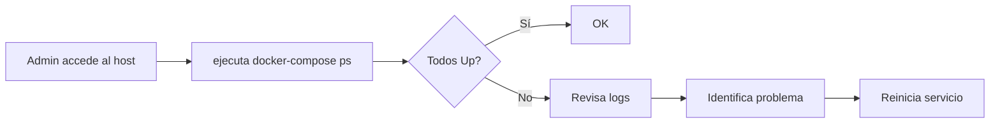

# Especificación Funcional: Infraestructura

## 1. Propósito

Define qué necesita el sistema para funcionar: dependencias, configuración, despliegue y restricciones del hardware objetivo.

## 2. Glosario de Dominio

| Término | Definición | Ejemplo |
|---------|------------|---------|
| **Honeypot** | Servidor trampa que simula servicios reales para capturar actividad de atacantes | Servidor HTTP que finge ser un panel de admin |
| **Modo degradado** | Estado del sistema cuando un componente falla pero los honeypots siguen funcionando | Sin LLM, respuestas estáticas |
| **Modo full simulation** | Todos los honeypots responden con maximum realismo | HTTP sirve dashboard, SSH simula shell completa |
| **Modo minimal** | Honeypots básicos, sin LLM, respuestas estáticas simples | Para testing o hardware limitado |

> **Regla:** "Modo" se refiere siempre al nivel de simulación, nunca al estado del sistema.

## 3. Casos de Uso

### 3.1 CU-001: Instalación del Sistema
- **ID:** CU-001
- **Actor:** Administrador del honeypot
- **Precondiciones:** Docker y Docker Compose instalados en el host
- **Postcondiciones:** Sistema corriendo con todos los honeypots activos
- **Flujo Principal:**
  1. Admin clona el repositorio
  2. Admin ejecuta `cp .env.example .env` y configura variables
  3. Admin ejecuta `docker-compose up -d`
  4. Sistema verifica prerequisitos (Ollama, SQLite)
  5. Sistema inicia honeypots en puertos configurados
  6. Admin verifica con `docker-compose ps` que todo está "Up"
- **Flujos Alternativos:**
  - [Ollama no disponible]: Sistema inicia en modo degradado, log de warning
  - [Puerto ocupado]: Sistema falla con error claro, admin libera el puerto
- **Flujos de Excepción:**
  - [Docker no instalado]: Mensaje de error con instrucciones de instalación
  - [.env faltante]: Sistema usa valores por defecto, log de warning

### 3.2 CU-002: Verificación de Salud
- **ID:** CU-002
- **Actor:** Sistema (automático)
- **Precondiciones:** Honeypots desplegados
- **Postcondiciones:** Estado de cada servicio registrado en logs
- **Flujo Principal:**
  1. Health check ejecuta cada 5 minutos
  2. Verifica cada honeypot (HTTP, SSH, FTP, MySQL)
  3. Verifica Ollama
  4. Registra estado en logs
  5. Si algún servicio falla, intenta restart
- **Flujos Alternativos:**
  - [Servicio no responde]: Restart automático vía docker-compose
  - [Restart falla]: Notificación al admin (log + webhook si está configurado)

### 3.3 CU-003: Actualización del Sistema
- **ID:** CU-003
- **Actor:** Administrador
- **Precondiciones:** Sistema corriendo, nueva versión disponible
- **Postcondiciones:** Sistema actualizado sin perder datos
- **Flujo Principal:**
  1. Admin ejecuta `git pull`
  2. Admin ejecuta `docker-compose build`
  3. Admin ejecuta `docker-compose up -d`
  4. Docker recrea contenedores con nueva imagen
  5. Datos persisten en volumen montado (`./data`)
- **Flujos Alternativos:**
  - [Build falla]: Admin revisa logs, corrige errores
  - [DB migration necesaria]: Script de migración se ejecuta automáticamente

## 4. Reglas de Negocio

### 4.1 RN-001: Los honeypots DEBEN ser indistinguibles de servidores reales
- **ID:** RN-001
- **Descripción:** Un atacante experimentado NO debe detectar que es un honeypot en la primera interacción
- **Invariante:** Todas las respuestas de honeypots DEBEN seguir protocolos estándar
- **Validación:** Test manual con herramientas de escaneo (nmap, sqlmap, Hydra)
- **Ejemplo:** SSH honeypot DEBE retornar banner `SSH-2.0-OpenSSH_8.2p1`

### 4.2 RN-002: El sistema DEBE funcionar sin LLM
- **ID:** RN-002
- **Descripción:** Si Ollama no está disponible, los honeypots DEBEN seguir capturando datos
- **Invariante:** Ningún honeypot DEBE depender del LLM para funcionar
- **Validación:** Detener Ollama, verificar que honeypots siguen activos
- **Ejemplo:** HTTP honeypot usa respuestas estáticas cuando LLM no responde

### 4.3 RN-003: Los datos DEBEN persistir entre reinicios
- **ID:** RN-003
- **Descripción:** Los datos de ataques NO se pierden al reiniciar el sistema
- **Invariante:** El volumen Docker `./data` DEBE estar montado permanentemente
- **Validación:** Reiniciar sistema, verificar que datos anteriores existen
- **Ejemplo:** Attack registrado antes del reinicio sigue en SQLite después

### 4.4 RN-004: El sistema DEBE ser accesible externamente
- **ID:** RN-004
- **Descripción:** Los honeypots DEBEN ser alcanzables desde Internet para atraer atacantes
- **Invariante:** Al menos HTTP y SSH DEBEN estar expuestos públicamente
- **Validación:** Conexión externa a los puertos expuestos
- **Ejemplo:** `curl http://<ip-publica>` retorna la página de login

## 5. Flujos de Usuario

### 5.1 Flujo: Administrador revisa estado del sistema

- **Descripción:** Verificación manual del estado del sistema
- **Pasos detallados:**
  1. Admin se conecta al host via SSH
  2. Ejecuta `docker-compose ps`
  3. Verifica que todos los servicios muestran "Up"
  4. Si alguno está "Restarting" o "Exited", revisa logs
  5. Ejecuta `docker-compose logs [servicio]` para diagnóstico

## 6. Invariantes del Dominio

| ID | Invariante | Verificación |
|----|------------|--------------|
| INV-001 | Los honeypots NUNCA deben ejecutar código del host real | Audit: no hay `exec`, `spawn` con comandos del sistema |
| INV-002 | Los datos de atacantes NUNCA se pierden por reinicio | Test: registrar ataque, reiniciar, verificar persistencia |
| INV-003 | El sistema DEBE funcionar con cualquier combinación de servicios externos caídos | Test: detener Ollama, verificar honeypots activos |
| INV-004 | Ningún honeypot DEBE revelar que es un honeypot | Test: escaneo con nmap, sqlmap, Hydra |

## 7. Restricciones de Negocio

### 7.1 Hardware
- Mínimo: Raspberry Pi 4 con 4GB RAM
- Recomendado: Mini PC con 8GB RAM
- Almacenamiento: 32GB SD card mínimo (64GB recomendado)
- Red: conexión a Internet con IP pública o Cloudflare Tunnel

### 7.2 Costo
- Sin dependencias de APIs externas pagas
- Sin licencias de software requeridas
- Costo operativo: electricidad del hardware (~5W para RPi4)

### 7.3 Legal
- El honeypot DEBE cumplir con leyes locales de monitorización
- Los logs NO deben contener datos personales além dos atacantes
- El admin DEBE ser consciente de las implicaciones legales de honeypots

## 8. Métricas de Éxito

- **Tasa de detección de ataques:** 100% de interacciones con honeypots se registran
- **Tiempo de uptime:** > 99% al mes
- **Falsos positivos:** < 1% de tráfico legítimo clasificado como ataque
- **Tiempo de respuesta:** < 200ms para respuestas HTTP (sin LLM)

## 9. No Funcional (desde perspectiva de usuario)

- **Disponibilidad:** 24/7/365
- **Mantenimiento:** Requiere revisión semanal de logs (~15 min)
- **Usabilidad:** CLI para administración, sin interfaz web admin
- **Soporte:** Documentación en README, sin soporte comercial

## 10. Changelog

| Versión | Fecha | Cambios |
|---------|-------|---------|
| 1.0.0 | 2026-06-12 | Versión inicial |
