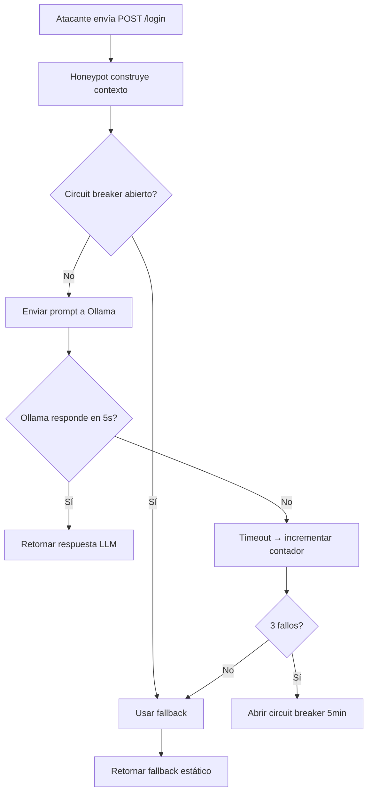

# Especificación Funcional: Integración LLM

## 1. Propósito

Define cómo el sistema utiliza un modelo de lenguaje (LLM) para generar respuestas HTTP realistas en tiempo real y analizar patrones de ataque en el pipeline nocturno.

## 2. Glosario de Dominio

| Término | Definición | Ejemplo |
|---------|------------|---------|
| **Real-time Response** | Respuesta generada por LLM durante un ataque HTTP para mantener al atacante enganchado | HTML de dashboard generado dinámicamente |
| **Analysis** | Proceso de examinar todos los ataques del día y generar insights | Resumen ejecutivo, tendencias, IOCs |
| **Prompt Template** | Plantilla de texto con variables que se envía al LLM | `Eres un admin de servidor. Un atacante desde {{ip}} ejecutó {{command}}` |
| **Circuit Breaker** | Mecanismo que desactiva el LLM temporalmente si falla repetidamente | 3 fallos → desactivar por 5 minutos |
| **Fallback** | Respuesta predefinida que se usa cuando el LLM no está disponible | HTML estático para cada ruta HTTP |
| **IOC** | Indicador de Compromiso: patrón identificable de actividad maliciosa | IP con patrón de scan, user-agent de herramienta conocida |

> **Regla:** "Real-time" se refiere solo a respuestas HTTP generadas durante el ataque, no a análisis en tiempo real del sistema.

## 3. Casos de Uso

### 3.30 CU-028: Generar Respuesta HTTP con LLM
- **ID:** CU-030
- **Actor:** Honeypot HTTP (automático)
- **Precondiciones:** Ollama disponible, modelo cargado
- **Postcondiciones:** Respuesta HTML generada y enviada al atacante
- **Flujo Principal:**
  1. Atacante envía request HTTP
  2. Honeypot construye contexto: path, method, body, previous_messages
  3. Honeypot envía prompt a Ollama
  4. Ollama genera respuesta (máx 500 tokens)
  5. Honeypot retorna HTML al atacante
  6. Prompt y respuesta se registran en SQLite
- **Flujos Alternativos:**
  - [Ollama no responde en 5s]: Timeout → usar fallback
  - [Ollama retorna error]: Circuit breaker incrementa contador
  - [Circuit breaker abierto]: Usar fallback directamente

### 3.31 CU-029: Generar Respuesta con Fallback
- **ID:** CU-031
- **Actor:** Honeypot HTTP (automático)
- **Precondiciones:** LLM no disponible (timeout, error, circuit breaker abierto)
- **Postcondiciones:** Respuesta estática enviada al atacante
- **Flujo Principal:**
  1. LLM falla o no está disponible
  2. Honeypot selecciona respuesta estática según la ruta
  3. Retorna HTML predefinido
  4. Registra en SQLite: "response_type: static"
- **Flujos Alternativos:**
  - [Ruta no tiene fallback]: Retornar 404 page estático

### 3.32 CU-030: Analizar Ataques del Día
- **ID:** CU-032
- **Actor:** Pipeline nocturno (automático)
- **Precondiciones:** Ollama disponible, ataques del día en SQLite
- **Postcondiciones:** Análisis completo generado
- **Flujo Principal:**
  1. Pipeline extrae todos los ataques del día
  2. Construye prompt con estadísticas y payloads
  3. Envía a Ollama para análisis
  4. LLM genera: executive summary, per-IP detail, trends, IOCs
  5. Resultado se usa para generar el reporte Markdown
- **Flujos Alternativos:**
  - [LLM falla]: Generar análisis básico sin LLM (estadísticas simples)
  - [No hay ataques]: Generar reporte "No attacks recorded"

### 3.33 CU-031: Verificar Disponibilidad de Ollama
- **ID:** CU-033
- **Actor:** Sistema (automático)
- **Precondiciones:** Ninguna
- **Postcondiciones:** Estado de Ollama verificado
- **Flujo Principal:**
  1. Cada 60 segundos, sistema envía `GET /api/tags` a Ollama
  2. Si responde 200: Ollama disponible
  3. Si no responde: circuit breaker incrementa contador
  4. Si 3 fallos consecutivos: abrir circuit breaker (5 minutos)
- **Flujos Alternativos:**
  - [Ollama se recupera]: Cerrar circuit breaker, reanudar uso del LLM

## 4. Reglas de Negocio

### 4.1 RN-029: Las respuestas del LLM NUNCA deben revelar que es un honeypot
- **ID:** RN-029
- **Descripción:** El LLM no debe generar texto que sugiera que el sistema es una trampa
- **Invariante:** Ninguna respuesta contiene "honeypot", "trap", "decoy", "fake"
- **Validación:** Test: enviar 100 prompts, verificar que ninguna respuesta revela
- **Ejemplo:** Si el atacante pregunta "¿Eres un honeypot?" → el LLM responde como un admin real

### 4.2 RN-030: El LLM DEBE generar respuestas en el idioma del atacante
- **ID:** RN-030
- **Descripción:** Si el atacante escribe en español, la respuesta debe ser en español
- **Invariante:** El idioma de la respuesta DEBE coincidir con el del request
- **Validación:** Test: enviar requests en español, inglés, francés
- **Ejemplo:** Request en español → respuesta en español

### 4.3 RN-031: El circuit breaker DEBE proteger contra fallos en cascada
- **ID:** RN-031
- **Descripción:** Si Ollama falla 3 veces, el sistema debe usar fallback por 5 minutos
- **Invariante:** Después de 3 fallos, no se envían requests a Ollama por 5 minutos
- **Validación:** Test: simular 3 fallos, verificar que los siguientes 10 requests usan fallback
- **Ejemplo:** 3 timeouts → circuit breaker abierto → fallback por 5min → reintentar

### 4.4 RN-032: Los prompts DEBEN ser predefinidos, no dinámicos
- **ID:** RN-032
- **Descripción:** Los prompts se cargan de archivos estáticos, no se construyen dinámicamente
- **Invariante:** Cada tipo de interacción tiene un prompt fijo
- **Validación:** Verificar que los prompts no cambian entre ejecuciones
- **Ejemplo:** Prompt de login: "Un usuario desde {{ip}} intentó登录 con {{credentials}}"

### 4.5 RN-033: El análisis del pipeline DEBE incluir IOCs
- **ID:** RN-033
- **Descripción:** El análisis generado por LLM debe identificar al menos 1 IOC por día con actividad
- **Invariante:** Si hay ataques, el análisis DEBE incluir tabla de IOCs
- **Validación:** Test: día con 10 ataques → al menos 1 IOC identificado
- **Ejemplo:** IOC tipo "ip" con valor "1.2.3.4" y confidence 0.9

## 5. Flujos de Usuario

### 5.1 Flujo: Respuesta LLM en tiempo real

- **Descripción:** Flujo completo de generación de respuesta con manejo de errores
- **Pasos detallados:**
  1. Request llega al honeypot HTTP
  2. Se verifica el estado del circuit breaker
  3. Si está abierto, se usa fallback inmediatamente
  4. Si está cerrado, se envía prompt a Ollama
  5. Si Ollama responde, se retorna la respuesta generada
  6. Si falla, se incrementa el contador de fallos
  7. Si 3 fallos, se abre el circuit breaker

## 6. Invariantes del Dominio

| ID | Invariante | Verificación |
|----|------------|--------------|
| INV-029 | El LLM NUNCA revela que es honeypot | Test: 100 prompts adversariales |
| INV-030 | El circuit breaker se cierra después de 5 minutos | Test: abrir, esperar 5min, verificar cierre |
| INV-031 | El fallback está disponible para TODAS las rutas HTTP | Test: cada ruta tiene fallback |
| INV-032 | Los prompts son idénticos entre ejecuciones | Test: comparar prompts entre runs |

## 7. Restricciones de Negocio

### 7.1 Calidad de Respuestas
- Las respuestas del LLM DEBEN ser coherentes con el contexto del request
- El LLM NO debe generar código malicioso
- El LLM NO debe dar información sobre el sistema real
- Las respuestas DEBEN ser cortas (máx 500 tokens)

### 7.2 Rendimiento
- Latencia máxima del LLM: 5 segundos (timeout)
- Máximo de requests simultáneos a Ollama: 1 (en RPi4)
- Memory usage del modelo: ~1.5GB (Qwen 2.5:1.5b)

### 7.3 Disponibilidad
- Si el LLM falla, el honeypot DEBE seguir funcionando
- El fallback DEBE cubrir todas las rutas
- El circuit breaker DEBE prevenir retry storm

## 8. Métricas de Éxito

- **Tasa de disponibilidad del LLM:** > 95% del tiempo
- **Calidad de respuestas:** > 80% coherentes (evaluación manual)
- **Latencia promedio:** < 3 segundos
- **Falsos positivos del circuit breaker:** < 1%

## 9. No Funcional (desde perspectiva de usuario)

- **Tiempo de respuesta HTTP:** < 5 segundos (con LLM), < 200ms (fallback)
- **Uptime del honeypot:** 100% (independiente del LLM)
- **Memoria:** ~1.5GB para el modelo LLM

## 10. Changelog

| Versión | Fecha | Cambios |
|---------|-------|---------|
| 1.0.0 | 2026-06-12 | Versión inicial |
