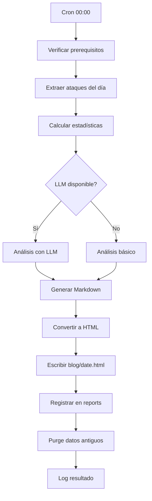

# Especificación Funcional: Pipeline Nocturno y Blog

## 1. Propósito

Define el proceso automatizado que genera diariamente un informe de amenazas HTML a partir de los datos capturados por los honeypots, y lo publica en un blog estático accesible públicamente.

## 2. Glosario de Dominio

| Término | Definición | Ejemplo |
|---------|------------|---------|
| **Nightly Pipeline** | Proceso batch que corre diariamente a las 00:00 vía cron | Ejecuta: extract → analyze → generate → publish |
| **Threat Report** | Documento HTML con resumen de ataques del día | Incluye: executive summary, stats, per-IP, trends, IOCs |
| **Executive Summary** | Resumen de 2-3 párrafos generado por LLM | "Today 45 attacks were detected from 12 unique IPs..." |
| **IOC** | Indicador de Compromiso identificable y compartible | IP, patrón de user-agent, patrón de payload |
| **Static Blog** | Colección de archivos HTML servidos directamente | Cada reporte es una página standalone |
| **Retención** | Período que los datos se mantienen antes de purgar | 90 días (configurable) |
| **Purge** | Eliminación automática de registros antiguos | DELETE FROM attacks WHERE created_at < date('now', '-90 days') |

> **Regla:** "Reporte" se refiere al documento HTML generado, no a la acción de reportar.

## 3. Casos de Uso

### 3.34 CU-032: Ejecutar Pipeline Nocturno
- **ID:** CU-034
- **Actor:** Cron job (automático)
- **Precondiciones:** Datos del día en SQLite, Ollama disponible (opcional)
- **Postcondiciones:** Reporte HTML generado y publicado
- **Flujo Principal:**
  1. Cron ejecuta `scripts/nightly.sh` a las 00:00
  2. Script verifica prerequisitos (Ollama, SQLite)
  3. Ejecuta `node src/pipeline/nightly.js`
  4. Pipeline extrae ataques del día anterior
  5. Genera estadísticas (total, unique IPs, top IPs, services)
  6. Envía a LLM para análisis (si disponible)
  7. Genera Markdown con executive summary + stats + detail + trends + IOCs
  8. Convierte Markdown a HTML con template
  9. Escribe `blog/{date}.html`
  10. Registra en tabla `reports`
  11. Ejecuta purge de datos antiguos
  12. Log resultado a `logs/pipeline-{date}.log`
- **Flujos Alternativos:**
  - [Ollama no disponible]: Pipeline genera reporte con análisis básico (sin LLM)
  - [No hay ataques]: Genera reporte "No attacks recorded for {date}"
  - [SQLite corrupto]: Log error, notificar admin, abortar pipeline
  - [Pipeline ya ejecutado hoy]: No duplicar reporte (idempotente)

### 3.35 CU-033: Ver Reporte en Blog
- **ID:** CU-035
- **Actor:** Visitante del blog (humano o bot)
- **Precondiciones:** Reporte generado y publicado
- **Postcondiciones:** Visitante lee el reporte
- **Flujo Principal:**
  1. Visitante accede a `http://<blog-url>/`
  2. Ve lista de reportes disponibles (ordenados por fecha descendente)
  3. Hace clic en un reporte
  4. Lee executive summary, stats, detail, trends, IOCs
- **Flujos Alternativos:**
  - [Reporte no existe]: 404 page
  - [Blog no está corriendo]: Error de conexión

### 3.36 CU-034: Limpiar Datos Antiguos
- **ID:** CU-036
- **Actor:** Pipeline nocturno (automático, después del reporte)
- **Precondiciones:** Tablas con datos antiguos
- **Postcondiciones:** Registros más antiguos que retención eliminados
- **Flujo Principal:**
  1. Pipeline calcula fecha de corte
  2. Ejecuta DELETE en attacks y sessions antiguos
  3. Registra cantidad eliminada en log
- **Flujos Alternativos:**
  - [No hay datos antiguos]: Log informativo, no hace nada

### 3.37 CU-035: Rotar Logs
- **ID:** CU-037
- **Actor:** Cron job (diario a las 01:00)
- **Precondiciones:** Archivos de log existentes
- **Postcondiciones:** Logs rotados, antiguos comprimidos
- **Flujo Principal:**
  1. Cron ejecuta `scripts/log-rotation.sh`
  2. Mueve `pipeline-2026-06-12.log` a `logs/archive/`
  3. Comprime logs de más de 7 días
  4. Elimina logs de más de 30 días
- **Flujos Alternativos:**
  - [No hay logs]: No hace nada

### 3.38 CU-036: Mantenimiento de Base de Datos
- **ID:** CU-038
- **Actor:** Cron job (semanal, dom 02:00)
- **Precondiciones:** SQLite con datos
- **Postcondiciones:** DB optimizada, backup creado
- **Flujo Principal:**
  1. Cron ejecuta `scripts/db-maintenance.sh`
  2. Ejecuta `VACUUM` en SQLite (reclamar espacio)
  3. Crea backup comprimido: `data/sentinel-{date}.db.gz`
  4. Elimina backups de más de 30 días
- **Flujos Alternativos:**
  - [VACUUM falla]: Log error, continuar (no crítico)

## 4. Reglas de Negocio

### 4.1 RN-034: El pipeline DEBE ser idempotente
- **ID:** RN-034
- **Descripción:** Ejecutar el pipeline dos veces para el mismo día NO debe duplicar el reporte
- **Invariante:** UNIQUE constraint en report_date
- **Validación:** Test: ejecutar pipeline dos veces, verificar 1 solo reporte
- **Ejemplo:** Primera ejecución → genera reporte; segunda → "Report already exists"

### 4.2 RN-035: El reporte DEBE incluir executive summary generado por LLM
- **ID:** RN-035
- **Descripción:** Si el LLM está disponible, el executive summary DEBE ser generado por él
- **Invariante:** Si LLM disponible, executive summary NO es texto estático
- **Validación:** Test: verificar que el summary cambia con diferentes datos de ataque
- **Ejemplo:** Día con 5 ataques → summary diferente a día con 100 ataques

### 4.3 RN-036: El blog DEBE ser accesible públicamente
- **ID:** RN-036
- **Descripción:** Los reportes DEBEN ser accesibles desde Internet
- **Invariante:** Al menos el index.html y un reporte deben ser accesibles vía HTTP
- **Validación:** Test: curl desde máquina externa, verificar 200
- **Ejemplo:** `http://<ip>:8080/` retorna index con lista de reportes

### 4.4 RN-037: Los IOCs DEBEN ser exportables
- **ID:** RN-037
- **Descripción:** Cada reporte DEBE incluir una tabla de IOCs en formato tabular
- **Invariante:** Tabla de IOCs tiene: type, value, confidence
- **Validación:** Test: parsear HTML, verificar tabla de IOCs
- **Ejemplo:** Tabla con IP "1.2.3.4", confidence "0.9"

### 4.5 RN-038: El purge DEBE ejecutarse después de cada reporte
- **ID:** RN-038
- **Descripción:** Después de generar el reporte, se eliminan datos antiguos
- **Invariante:** Purge se ejecuta exactamente una vez por día
- **Validación:** Log con timestamp y cantidad eliminada
- **Ejemplo:** "Purge: 1,234 records deleted (older than 90 days)"

## 5. Flujos de Usuario

### 5.1 Flujo: Pipeline nocturno completo

- **Descripción:** Flujo completo del pipeline nocturno
- **Pasos detallados:**
  1. Cron dispara el script a las 00:00
  2. Se verifican prerequisitos
  3. Se extraen y analizan los datos
  4. Se genera el reporte
  5. Se publica y se limpia

### 5.2 Flujo: Visitante accede al blog

- **Descripción:** Flujo de lectura del blog
- **Pasos detallados:**
  1. Visitante accede a la URL del blog
  2. Ve lista de reportes disponibles
  3. Selecciona uno y lo lee

## 6. Invariantes del Dominio

| ID | Invariante | Verificación |
|----|------------|--------------|
| INV-034 | El pipeline es idempotente | Test: ejecutar 2 veces, 1 solo reporte |
| INV-035 | Cada reporte tiene executive summary | Verificar campo en HTML |
| INV-036 | El blog es accesible vía HTTP | Test: curl desde externo |
| INV-037 | Los IOCs son exportables en tabla | Parsear HTML, verificar tabla |
| INV-038 | El purge corre después de cada reporte | Verificar log con timestamp |

## 7. Restricciones de Negocio

### 7.1 Calidad del Reporte
- Executive summary: 2-3 párrafos, lenguaje claro
- Estadísticas: números precisos, no aproximaciones
- Per-IP detail: al menos 3 sentence por IP activa
- IOCs: mínimo 1 IOC por día con actividad
- Trends: al menos 1 tendencia identificada

### 7.2 Formato del Blog
- HTML standalone (CSS embebido, sin JS)
- Responsive (móvil, tablet, desktop)
- Tema oscuro estilo cybersecurity
- Monospace para datos técnicos
- Colores: fondo #0a0a0a, texto #e0e0e0, accent #00ff41

### 7.3 Rendimiento
- Pipeline: máximo 5 minutos de ejecución
- Blog: carga < 100ms (HTML estático)
- Tamaño máximo de reporte: 500KB

### 7.4 Retención
- Datos: 90 días (configurable)
- Reportes HTML: indefinidos (se acumulan)
- Logs: 30 días
- Backups: 30 días

## 8. Métricas de Éxito

- **Tasa de éxito del pipeline:** > 99% (falla < 1 vez al mes)
- **Tiempo de ejecución:** < 3 minutos promedio
- **Calidad del reporte:** Executive summary coherente (evaluación manual)
- **Disponibilidad del blog:** > 99.9%
- **IOCs identificados:** > 0 por día con actividad

## 9. No Funcional (desde perspectiva de usuario)

- **Disponibilidad del blog:** 24/7
- **Tiempo de carga:** < 1 segundo
- **Accesibilidad:** URLs estables para compartir
- **Actualización:** Nuevo reporte disponible a las 00:05

## 10. Changelog

| Versión | Fecha | Cambios |
|---------|-------|---------|
| 1.0.0 | 2026-06-12 | Versión inicial |
